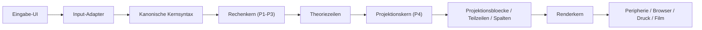

# Architektur Kurz

Status: operativ  
Stand: 12. Juli 2026

## Zweck
Dieses Blatt ist die **kurze Gesamtzusammenfassung** der Projektarchitektur.
Es soll in 1 bis 2 Minuten beantworten:
- Welche Schichten gibt es?
- Wer ist fuer was zustaendig?
- Wie laufen die Daten?

Der verbindliche Ablauf ueber alle Durchlaeufe steht jetzt in:
- [GESAMTPROZESS.md](./GESAMTPROZESS.md)

## Die 5 Schichten

### 1. Input-Adapter
Nimmt verschiedene Eingabeformen entgegen und uebersetzt sie in **eine kanonische Kernsyntax**.

Beispiele:
- Lehrereingabe wie `2x+3=5`
- Unicode wie `2·x−3=5`
- LaTeX-nahe Eingabe wie `\\sqrt{x+3}=5`

Wichtig:
- viele UIs sind erlaubt
- der Kern lernt trotzdem nur **eine** Sprache

Siehe:
- [INPUT_ADAPTER_LAYER.md](/Users/martinwyrwich/Developer/math-projects/Gleichungslöser/docs/Architecture/INPUT_ADAPTER_LAYER.md)

### 2. Rechenkern
Besteht praktisch aus:
- `P1_Eingabe`
- `P2_Strategie_Analyse`
- `P3_Umformung`

Verantwortung:
- Eingabe strukturieren
- Zielvariable festlegen
- naechste Umformungsfamilie waehlen
- Gleichung **semantisch** umbauen

Wichtig:
- hier entsteht die mathematische Wahrheit
- hier wird **nicht** gerendert

### 3. Projektionskern
Besteht praktisch aus:
- `P4_Projektion`

Verantwortung:
- globale Spalten
- Gleichheitsanker
- Projektionsrollen wie Zaehler, Bruchstrich, Nenner
- Projektionsbloecke und Teilzeilen

Wichtig:
- **horizontal** kommt die Ortstreue von hier
- P4 ist medienneutral, nicht typografisch

### 4. Renderkern
Sitzt aktuell produktnah in der Arbeitsblatt-Huelle.

Praktisch heute:
- `renderKernelCore/renderNodeFactory.js`
- `renderKernelCore/rowMetrics.js`
- `renderKernel.js` nur noch als oeffentliche Fassade

Verantwortung:
- mathematische Boxen fuer Bruch, Wurzel, Potenz, Funktion, Gruppe
- vertikale Achsenlogik
- Achsenreserven, Achsenbalance, Teilzeilenversatz, Achsenkontext

Wichtig:
- **vertikal** kommt die mathematische Setzung von hier
- der Renderkern entscheidet keine Algebra neu

### 5. Peripherie / UI
Beispiele:
- Browser-UI
- Druckansicht
- Diagnoseansicht
- spaeter Film oder andere Ausgabemedien

Verantwortung:
- Eingabe entgegennehmen
- Diagnose anzeigen
- Renderdaten im jeweiligen Medium sichtbar machen

Wichtig:
- die Peripherie ist plug-and-play
- sie darf keine zweite Wahrheit neben dem Kern erzeugen

## Datenfluss

## Ein Satz pro Schicht
- Input-Adapter: **vereinheitlicht Eingabe**
- Rechenkern: **entscheidet mathematisch**
- Projektionskern: **verankert horizontal**
- Renderkern: **setzt vertikal**
- Peripherie: **zeigt im Medium**

## Merksatz
Der **Rechenkern** entscheidet,  
der **Projektionskern** verankert,  
der **Renderkern** setzt,  
die **Peripherie** zeigt.

## Naechste Detailblaetter
- [SYSTEMKARTE.md](/Users/martinwyrwich/Developer/math-projects/Gleichungslöser/docs/Architecture/SYSTEMKARTE.md)
- [BEGRIFFSBLATT_PROJEKTION.md](/Users/martinwyrwich/Developer/math-projects/Gleichungslöser/docs/Architecture/BEGRIFFSBLATT_PROJEKTION.md)
- [EXPORT_MODEL.md](/Users/martinwyrwich/Developer/math-projects/Gleichungslöser/docs/Architecture/EXPORT_MODEL.md)
- [INPUT_ADAPTER_LAYER.md](/Users/martinwyrwich/Developer/math-projects/Gleichungslöser/docs/Architecture/INPUT_ADAPTER_LAYER.md)
- [GESAMTPROZESS.md](./GESAMTPROZESS.md)
- [COLUMN_LAYOUT_PIPELINE.md](/Users/martinwyrwich/Developer/math-projects/6_Gleichungslöser/docs/Architecture/COLUMN_LAYOUT_PIPELINE.md)

Ergaenzung fuer die aktuelle Druckausgabe: LaTeX darf mathematische Schalen setzen, aber P4-Spalten muessen innerhalb dieser Schalen als feste Zellen erhalten bleiben. Siehe [LATEX_P4_RENDERING.md](./LATEX_P4_RENDERING.md).
