# Column Layout Pipeline

Stand: 7. September 2026

## Zweck

Dieses Blatt beschreibt nur die Spaltenbreitenkette fuer die spaltentreue Druckausgabe:

- welche Module beteiligt sind
- in welcher Reihenfolge sie arbeiten
- welches Modul fuer welche Aenderungsart zustaendig ist

Der uebergeordnete Solve- und Projektionsprozess steht in:

```text
docs/Architecture/GESAMTPROZESS.md
```

Die Implementierung dieses Bausteins liegt jetzt gebuendelt unter:

```text
components/Arbeitsblatt_Druckansicht/columnLayoutCore/
```

Die Dateien auf Ebene `components/Arbeitsblatt_Druckansicht/*.js` sind dazu nur noch oeffentliche Fassaden.

Es ist bewusst enger als die Gesamtarchitektur. Die grobe Schichtenkarte bleibt in `ARCHITEKTUR_KURZ.md`.

Die verbindliche Rasterregel fuer Brueche, Wurzeln und andere sichtbare Schalen steht in:

```text
docs/Architecture/FRACTION_ROOT_SPALTENTREUE_CONTRACT.md
```

## Die Modulfolge

```text
P4 / ViewModel
    -> atomWidthCatalog.js
    -> columnLayoutProfile.js
    -> columnTopology.js
    -> columnWidthAtoms.js
    -> columnWidths.js
    -> displayColumnLayout.js
    -> export_projection_pdf_core/latexRendering.js
    -> export_projection_pdf.mjs
    -> PDF / Diagnosebild
```

## Ein Satz pro Modul

- `columnLayoutProfile.js`: liefert benannte Breitenprofile und nur konfigurierbare Werte
- `atomWidthCatalog.js`: liefert die explizite Liste der bekannten Atombreiten
- `columnTopology.js`: liest und ordnet nur explizit gelieferte funktionale Shell-Slots
- `columnWidthAtoms.js`: berechnet nur physische Atombreiten in vorhandenen Spalten
- `columnWidths.js`: aggregiert diese visuellen Breiten ueber alle Loesungsschritte
- `displayColumnLayout.js`: fuehrt funktionale Slots und visuelle Breiten zu einer physischen Display-Karte zusammen
- `export_projection_pdf_core/latexRendering.js`: konsumiert das fertige Display-Layout und setzt daraus LaTeX/TikZ
- `export_projection_pdf.mjs`: bleibt nur CLI-Huelle fuer Parameter, Dateiausgabe und `pdflatex`
- `columnLayout.js`: bleibt nur oeffentliche Fassade der Breiten-API

## Datenfluss im Detail

```mermaid
flowchart LR
    A["P4-Projektionsdaten im ViewModel"] --> B["Profilwahl"]
    B --> C["columnLayoutProfile.js"]
    C --> D["atomWidthCatalog.js"]
    A --> E["columnTopology.js"]
    D --> F["columnWidthAtoms.js"]
    A --> F
    F --> G["zeilenlokale visuelle Breitenbeitraege"]
    G --> H["columnWidths.js"]
    H --> I["visuelle widths[]"]
    E --> J["explizit gelieferte funktionale Shell-Slots"]
    I --> K["displayColumnLayout.js"]
    J --> K
    K --> L["physische Slot-Karte"]
    L --> M["export_projection_pdf_core/latexRendering.js"]
    M --> N["LaTeX-P4-Zellen und Diagnoseoverlay"]
    N --> O["export_projection_pdf.mjs"]
    O --> P["PDF-Datei"]
```



## Verantwortungstrennung

### 1. Profile

Datei:

```text
components/Arbeitsblatt_Druckansicht/columnLayoutProfile.js
```

Enthaelt:

- `standard`
- `kompakt`
- `lesefreundlich`

Zustaendig fuer:

- atomare Minimalbreiten wie `+`, `=`, `5`
- Breitenwerte bereits definierter Shell-Slots
- Blockabstaende zwischen benachbarten semantischen Bloecken

Wenn sich nur Zahlenwerte aendern sollen:

```text
Nur dieses Modul anfassen.
```

### 2. Atomkatalog

Datei:

```text
components/Arbeitsblatt_Druckansicht/atomWidthCatalog.js
```

Zustaendig fuer:

- die explizite Liste bekannter Einzelatome
- Ziffern
- Variablenzeichen
- Operatoren
- Klammern und einfache Satzzeichen

Regel:

```text
Wenn ein einzelnes Zeichen als bekanntes Atom behandelt werden soll,
kommt es zuerst in diesen Katalog.
```

### 3. Abbildung sichtbarer Shell-Slots

Datei:

```text
components/Arbeitsblatt_Druckansicht/columnTopology.js
```

Zustaendig fuer das Lesen und Abbilden bereits gelieferter Slots wie:

- sichtbare Vor- und Nach-Slots wie:
  - Wurzelhaken
  - Gruppenklammer links/rechts
  - Funktionsname
  - Funktionsklammern
  - Potenzklammern und Exponent-Slot

Wenn sich die Frage aendert, welche sichtbaren Shell-Teile eigene funktionale Spalten brauchen:

```text
P4 und seinen Shell-Vertrag anfassen, nicht dieses Modul.
```

Dieses Modul darf keine Shell-Topologie aus Renderknoten oder Text erzeugen.

### 4. Atomare visuelle Breiten

Datei:

```text
components/Arbeitsblatt_Druckansicht/columnWidthAtoms.js
```

Zustaendig fuer:

- `resolveAtomicTextWidthEm(...)`
- `buildNodeColumnWidths(...)`

Dieses Modul entscheidet:

- wie aus einem einzelnen sichtbaren Atom eine Mindestbreite wird
- welche physische Mindestbreite eine bereits zugeordnete P4-Spalte fuer dieses Atom braucht

Wenn sich nur die lokale Breitenlogik aendern soll:

```text
Dieses Modul anfassen, aber nicht die globale Aggregation.
```

### 5. Globale visuelle Aggregation

Datei:

```text
components/Arbeitsblatt_Druckansicht/columnWidths.js
```

Zustaendig fuer:

- Breitenbeitraege pro Zeile sammeln
- Grenzabstaende zwischen Nachbarbloecken anwenden
- ueber alle Loesungsschritte das globale Maximum pro P4-Spalte bilden
- visuelle `widths[]`, `starts[]`, `totalWidth` erzeugen

Wenn sich nur die Regel aendert, wie lokale Beitraege global zusammenlaufen:

```text
Dieses Modul anfassen, aber nicht Atombreiten oder Profilwerte.
```

### 6. Physische Display-Karte

Datei:

```text
components/Arbeitsblatt_Druckansicht/displayColumnLayout.js
```

Zustaendig fuer:

- funktionale Shell-Slots und Inhaltsspalten in eine physische Slot-Reihenfolge bringen
- `slots[]`, `starts[]`, `totalWidth` fuer die sichtbare Ausgabe erzeugen

Regel:

```text
Dieses Modul fuehrt zusammen.
Es erfindet weder neue funktionale Spuren noch neue Shell-Regeln.
```

### 7. Exporter-Kern

Datei:

```text
scripts/export_projection_pdf_core/latexRendering.js
```

Zustaendig fuer:

- Profil entgegennehmen
- `buildDisplayColumnLayout(...)` konsumieren
- mit semantischen Breiten und sichtbaren Display-Slots LaTeX-Zellen, Fractions und Diagnosekoordinaten setzen

Regel:

```text
Der Exporter erfindet weder Slot-Topologie noch Breitenregeln.
Er konsumiert sie nur noch.
```

### 8. Exporter-CLI

Datei:

```text
scripts/export_projection_pdf.mjs
```

Zustaendig fuer:

- Kommandozeilenargumente einlesen
- den Solve-Lauf starten
- die gerenderte LaTeX-Datei schreiben
- `pdflatex` aufrufen

Regel:

```text
Diese Datei orchestriert nur noch.
Renderlogik gehoert in export_projection_pdf_core/.
```

## Stabiler Aenderungspfad

Wenn ein funktionierender Teil unangetastet bleiben soll, gilt:

- neue Profilvariante noetig: `columnLayoutProfile.js`
- neues einzelnes Atomzeichen noetig: `atomWidthCatalog.js`
- neue sichtbare Shell-Spalte noetig: `columnTopology.js`
- neue Atom- oder lokale Inhaltsbreite noetig: `columnWidthAtoms.js`
- neue Aggregationsregel noetig: `columnWidths.js`
- neue physische Slot-Zusammenfuehrung noetig: `displayColumnLayout.js`
- neues Ausgabemedium oder neues CLI-Verhalten noetig: Exporter oder anderer Konsument

## Profilnutzung

Beispiele:

```js
buildColumnLayout(viewModel, "standard");
buildColumnLayout(viewModel, "kompakt");
buildColumnLayout(viewModel, "lesefreundlich");
```

Oder mit explizitem Profilobjekt:

```js
const profile = getColumnLayoutProfile("lesefreundlich");
profile.semanticBoundaryGapEm.byRolePair["product_content|product_factor"] = 0.4;
buildColumnLayout(viewModel, profile);
```

## Aktuelle Leitregel

```text
Atomkatalog bestimmt bekannte Einzelzeichen.
Profil bestimmt ihre Werte und Abweichungen.
Topologiemodul bestimmt sichtbare Shell-Slots.
Atommodul bestimmt lokale Inhaltsbreiten.
Breitenmodul bestimmt globale semantische Spalten.
Displaymodul fuehrt Topologie und Breite zusammen.
Exporter setzt nur noch.
```
