# Gesamtprozess

Status: operativ-normativ  
Stand: 7. September 2026

## Zweck
Dieses Blatt beschreibt den verbindlichen Gesamtprozess des Gleichungsloesers von der Eingabe bis zur spaltentreuen Ausgabe.

Es beantwortet vier Fragen:

1. In welchen Durchlaeufen arbeitet das System?
2. Welche Daten entstehen nach jedem Durchlauf?
3. Welche Komponente darf welche Entscheidung treffen?
4. Woran erkennen wir, dass eine Komponente zu viel tut?

## Leitregel

```text
Theorie zuerst.
Semantische Schachtelung danach unveraendert lesen.
Funktionale Orts- und Schalengeometrie in P4 von innen nach aussen bauen.
Danach physische Breiten bestimmen.
Visuelle Geometrie und Rendering zuletzt.
```

## Ordnerregel

Die konkrete Spaltenlayout-Komponente liegt jetzt gebuendelt unter:

```text
components/Arbeitsblatt_Druckansicht/columnLayoutCore/
```

Die bisherigen Dateinamen auf oberer Ebene bleiben nur als duenne Fassaden bestehen, damit alte Importpfade nicht sofort brechen.

Damit gilt:

- Algebra wird nie im Renderer entschieden.
- sichtbare Shell-Slots werden nie im Breitenmodul erfunden.
- Breiten werden nie im Exporter erraten.
- CLI-Dateien orchestrieren nur und tragen keine eigene Renderlogik.
- Positionstreue ist kein UI-Effekt, sondern Teil des Kernvertrags.

## Der Gesamtfluss

```mermaid
flowchart LR
    A["Eingabe"] --> B["P1 Eingabe"]
    B --> C["kanonische Struktur mit stabilen IDs"]
    C --> D["P2 Strategie"]
    D --> E["P3 Umformung"]
    E --> F["Theorie-Zeilenfolge"]
    F --> G["P4 PreFlight"]
    G --> H["globale funktionale Spaltenmatrix"]
    H --> I["P4 Schalen- und Kindgeometrie bottom-up"]
    I --> J["P4 Setzlauf"]
    J --> K["Projektionszeilen mit Reihen, Spalten, Baendern und Darstellung"]
    K --> L["buildWorksheetViewModel"]
    L --> M["verlustfreies Worksheet-ViewModel"]
    M --> N["columnWidths.js"]
    N --> O["visuelle Spaltenbreiten"]
    M --> P["explizite funktionale Shell-Slots"]
    O --> Q["displayColumnLayout.js"]
    P --> Q
    Q --> R["physische Display-Slot-Karte"]
    R --> S["export_projection_pdf_core/latexRendering.js"]
    S --> T["visuelle LaTeX-/PDF-Geometrie"]
```



## Die zwei grossen Doppelpasse

### 1. Kern-Doppellauf

Der Kern arbeitet normativ in zwei Durchlaeufen:

1. Theorie erzeugen
2. positionstreu setzen

Das bedeutet:

- `P1` bis `P3` erzeugen nur die semantische Umbaugeschichte.
- `P4 PreFlight` sieht die gesamte Zeilenfolge und legt globale semantische Orte fest.
- `P4 Setzlauf` setzt danach alle Zeilen auf genau diese Orte.

Wichtig:

```text
Wenn sich algebraisch nichts aendert,
darf sich die horizontale Position spaeter nicht aendern.
```

### 2. Ausgabe-Doppellauf

Die Druckausgabe arbeitet in getrennten visuellen Stufen:

1. explizite funktionale Display-Topologie lesen
2. physische Breiten bestimmen
3. beides zu einer visuellen Slot-Karte abbilden
4. erst dann Tinte rendern

Das bedeutet:

- P4 entscheidet, welche sichtbaren Shell-Slots existieren.
- `columnTopology.js` bildet nur diese gelieferten Slots ab.
- `columnWidths.js` entscheidet, wie breit die funktionalen P4-Spalten physisch werden.
- `displayColumnLayout.js` fuehrt beide Welten zusammen.
- der Exporter setzt nur noch.

## Die Daten nach jeder Stufe

| Stufe | Eigentum | Ergebnis |
| :--- | :--- | :--- |
| `P1` | Parser/Struktur | Atome, Schalen, stabile IDs |
| `P2` | Strategie | naechster zulaessiger Umbau |
| `P3` | Theorie | Folge semantischer Gleichungszustaende |
| `P4 PreFlight` | Projektion | globale semantische Spaltenmatrix |
| `P4 Funktionalgeometrie und Setzlauf` | Projektion | Kinder, Reihen, Achsen, Baender, Primitive, Darstellungsform, `row`, `col`, `colStart`, `colEnd` |
| `viewModel.js` | Adapter | renderbares Worksheet-ViewModel |
| `columnTopology.js` | visuelle Abbildung | unveraendert gelesene funktionale Vor-/Nach-Slots fuer Shell-Tinte |
| `columnWidths.js` | visuelle Breiten | globale physische Breite je funktionaler P4-Spalte |
| `displayColumnLayout.js` | physische Karte | Reihenfolge und `start/width` aller Display-Slots |
| Exporter | Renderer | LaTeX/PDF oder Diagnosebild |

## Komponenten-Audit

### `core/index.js`

Soll:
- die produktive Solve-Kette orchestrieren
- Theorie-Zeilen sammeln
- P4 aufrufen
- das kanonische Rueckgabeobjekt bauen

Darf nicht:
- selbst Strategie- oder Projektionsregeln erfinden

Bewertung:
- korrekt, solange es orchestriert und nicht fachlich eingreift

### `P1_Eingabe`

Soll:
- Eingabe in kanonische Struktur uebersetzen
- stabile IDs anlegen

Darf nicht:
- Strategien bestimmen
- Positionen setzen

Bewertung:
- klar abgegrenzt

### `P2_Strategie_Analyse`

Soll:
- naechsten mathematisch zulaessigen Schritt waehlen

Darf nicht:
- direkt umformen
- rendern

Bewertung:
- klar abgegrenzt

### `P3_Umformung`

Soll:
- semantische Theorie-Zeilen erzeugen

Darf nicht:
- Spalten, Breiten oder sichtbare Slots bestimmen

Bewertung:
- klar abgegrenzt

### `P4_Projektion`

Soll:
- im PreFlight globale semantische Spalten vorbereiten
- funktionale Schalen-, Kind-, Band-, Reihen- und Achsengeometrie von innen nach aussen bauen
- pro Schalenauftreten die sichtbare Darstellungsform festlegen
- im Setzlauf dieselben Orte zeilenweise belegen

Darf nicht:
- Algebra neu entscheiden
- Exporttricks ausdenken

Bewertung:
- Kernvertrag der Positionstreue

### `viewModel.js`

Soll:
- Projektionsdaten in ein renderbares Worksheet-Modell uebersetzen
- keine neue Wahrheit erzeugen

Darf nicht:
- Spaltenlogik neu entscheiden
- Schalen, Kinder, Reihen oder Darstellungsformen rekonstruieren

Bewertung:
- Adapter, nicht Solver

### `renderKernelCore/`

Soll:
- explizite Darstellungsrollen in visuelle `renderNode`s abbilden
- gelieferte Teilzeilen und Achsen in physische Zellmetriken abbilden
- keine neue mathematische oder horizontale Wahrheit erfinden

Darf nicht:
- Spaltenbreiten berechnen
- sichtbare Shell-Slots definieren
- Reihenrollen oder Achsenkontexte aus Zellen inferieren
- Solver-Regeln neu entscheiden

Bewertung:
- natuerliches Untermodul fuer reine Render-Vorbereitung

### `renderKernel.js`

Soll:
- nur noch die oeffentliche Renderkernel-API bereitstellen

Darf nicht:
- zweite Logik neben `renderKernelCore/` pflegen

Bewertung:
- Fassade, kein zweites Logikmodul

### `columnTopology.js`

Soll:
- nur explizit gelieferte funktionale Shell-Slots abbilden
- also zum Beispiel:
  - Wurzelhaken links
  - Gruppenklammer links/rechts
  - Funktionsname vor dem Argument
  - Funktionsklammern
  - Potenzklammern und Exponent-Slot

Darf nicht:
- Breiten berechnen
- Export-Latex schreiben
- Shell-Slots, Kindbeziehungen oder Spannen aus Renderknoten erfinden

Bewertung:
- visueller Mapper, nicht Eigentuemer der Schalen-Topologie

### `columnWidthAtoms.js`

Soll:
- physische Atombreiten in bereits bekannten funktionalen Spalten bestimmen

Darf nicht:
- eigene sichtbare Shell-Slots erfinden

Bewertung:
- muss nur visuelle Atombreite rechnen

### `columnWidths.js`

Soll:
- visuelle Zeilenbeitraege global aggregieren
- pro funktionaler P4-Spalte das physische Maximum ueber den Loesungsprozess bilden

Darf nicht:
- neue sichtbare Shell-Slots definieren

Bewertung:
- reine visuelle Breitenaggregation

### `columnLayout.js`

Soll:
- oeffentliche Fassade fuer die Spaltenlayout-API bleiben

Darf nicht:
- eigene Fachlogik neben `columnLayoutCore/` pflegen

Bewertung:
- Fassade, kein zweites Logikmodul

### `displayColumnLayout.js`

Soll:
- visuelle Breiten und gelieferte funktionale Shell-Slots in eine physische Slot-Karte zusammenfuehren

Darf nicht:
- funktionale Spalten selbst neu bestimmen
- Shell-Regeln neu erfinden

Bewertung:
- Integrationsmodul zwischen Topologie und Breite

### `export_projection_pdf_core/latexRendering.js`

Soll:
- nur noch konsumieren:
  - visuelle Spaltenbreiten
  - explizite funktionale Display-Slots
  - explizite Darstellungsstruktur
- daraus LaTeX-Nodes setzen

Darf nicht:
- Klammer- oder Wurzel-Slots selbst definieren
- Breitenregeln erfinden
- Darstellungsform oder Schalenkinder aus LaTeX-Struktur rekonstruieren

Bewertung:
- Renderer, nicht Topologie- oder Breitenmodul

### `export_projection_pdf.mjs`

Soll:
- Eingabeparameter lesen
- Solve-Lauf starten
- `buildLatexDocument(...)` aufrufen
- `.tex` schreiben und `pdflatex` ausfuehren

Darf nicht:
- eigene Rendergeometrie bestimmen
- Shell- oder Breitenregeln erfinden

Bewertung:
- CLI-Orchestrator, nicht Renderkern

## Fehlersignale

Wenn eines davon passiert, sitzt die Regel wahrscheinlich im falschen Modul:

- eine sichtbare Klammer braucht Platz, aber nur das Profil wurde geaendert
- der Exporter fuegt ploetzlich eigene Shell-Spalten hinzu
- eine Breitenaenderung veraendert die Anzahl der Slots
- `P3` oder `renderKernel` beginnen horizontale Spaltenentscheidungen zu treffen
- ein Renderer muss raten, wo eine Shell beginnt oder endet

## Verbindliche Aenderungsregel

```text
Neue sichtbare Schale oder neuer sichtbarer Shell-Teil:
    P3 fuer die semantische Schale,
    P4 fuer funktionale Slots, Baender, Reihen und Primitive

Neue visuelle Tinte fuer einen bereits bekannten Shell-Teil:
    zustaendiger Renderer-Spezialist

Neue atomare Mindestbreite:
    atomWidthCatalog.js oder columnLayoutProfile.js

Neue lokale Inhaltsbreitenregel:
    columnWidthAtoms.js

Neue globale Max-Regel ueber alle Schritte:
    columnWidths.js

Neue physische Slot-Zusammenfuehrung:
    displayColumnLayout.js

Neue Ausgabeform:
    zuerst Core-Darstellungsvertrag,
    danach mechanische Renderer-/Exporter-Abbildung
```
