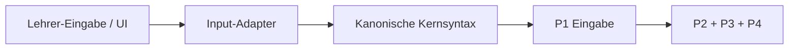

# Input Adapter Layer

Status: normativ-operativ  
Stand: 7. September 2026

## Zweck
Diese Schicht erklaert, wie unterschiedliche Eingabe-UIs denselben Gleichungsloeser-Kern bedienen koennen,
ohne dass der Kern selbst mehrere Eingabesprachen verstehen muss.

## Grundsatz
Der Kern soll genau **eine kanonische Eingabeform** verstehen.

Nicht der Kern lernt viele UIs.  
Sondern viele UIs werden ueber Adapter auf dieselbe Kernsprache gefuehrt.

## Architektur

## Aktuelle Schichten
### 1. Eingabe-UI
Moegliche Formen:
- Freitext wie `2x+3=5`
- tolerante Texteingabe mit `·`, `×`, `−`
- LaTeX-nahe Eingabe wie `\\sqrt{x+3}=5`
- spaeter Button-Palette oder visueller Formelaufbau

### 2. Input-Adapter
Aktuell produktnah begonnen in:
- `components/Arbeitsblatt_Druckansicht/inputAdapter.js`

Fuehrende lokale Richtlinie:

- `components/Arbeitsblatt_Druckansicht/INPUT_ADAPTER_CONTRACT.md`

Verantwortung:
- UI-nahe Schreibweisen in Kernsyntax ueberfuehren
- harmlose Oberflaechenunterschiede abfedern
- keine Mathematik neu loesen
- keine zweite semantische Wahrheit erzeugen

### 3. Kernsyntax
Der Kern arbeitet heute mit einer einfachen, kontrollierten Textsyntax wie:
- `sqrt(x+3)=5`
- `sin(x)=5`
- `(x)/(2)=5`
- `2*x+3=5`

Diese Syntax wird an `P1_Eingabe` uebergeben.

## Was Adapter duerfen
- `\\sqrt{...}` in `sqrt(...)` umschreiben
- `\\frac{a}{b}` in eine kontrollierte Divide-Syntax wie `a/b` oder `a/(b+c)` umschreiben
- `\\sin`, `\\cos`, `\\tan`, `\\arcsin`, ... normalisieren
- Unicode-Operatoren wie `·`, `×`, `−`, `÷` normalisieren
- symbolische Namen wie `\\alpha` in `alpha` ueberfuehren
- reine Quellsyntaxklammern bedeutungstreu in die kanonische Syntax uebertragen
- spaeter alltagstaugliche Schreibweisen wie `wurzel(...)` oder `sinus(...)` auf Kernsyntax mappen

## Was Adapter nicht duerfen
- mathematische Strategien vorwegnehmen
- Terme vereinfachen
- mathematisch wirksame Gruppen entfernen, um die Solve-Historie zu verkuerzen
- eine P2-Familie wie `group_release` unterdruecken
- Zielvariablen logisch erraten, wenn der Solve-Vertrag etwas anderes sagt
- Projektions- oder Renderdaten erzeugen
- Kernfehler verstecken, die fachlich relevant sind

## Aktueller Produktpfad
Heute wird der Adapter direkt in der Arbeitsblatt-Peripherie genutzt:
- `components/Arbeitsblatt_Druckansicht/logic.js`
- `components/Arbeitsblatt_Druckansicht/viewModel.js`

Der Solve-Aufruf bleibt trotzdem derselbe:
`GenesisCore.solve(normalisierteGleichung, options)`

## Warum diese Trennung wichtig ist
### Fuer den Kern
- der Kern bleibt klein und kontrolliert
- Tests muessen nicht jede UI-Schreibweise direkt gegen P1 absichern
- P1 kann weiter als kanonischer Familien-Parser wachsen

### Fuer die UI
- verschiedene Zielgruppen koennen verschiedene Eingabehilfen bekommen
- LaTeX ist nur noch eine Import-Sprache, nicht die Pflichtsprache
- spaetere Formel-Editoren koennen denselben Kern wiederverwenden

### Fuer den Projektstand
- Rechenkern und Projektionskern bleiben stabil
- Eingabe-UX kann iterativ verbessert werden, ohne den Kern dauernd umzubauen

## Aktuell bereits abgedeckt
Im begonnenen Adapter werden heute schon normalisiert:
- `\\sqrt{...}`
- `\\frac{...}{...}`
- `\\sin`, `\\cos`, `\\tan`
- `\\arcsin`, `\\arccos`, `\\arctan`
- `\\alpha`, `\\beta`, `\\theta`, ...
- `·`, `×`, `−`, `÷`

## Spaetere Ausbaustufen
### Stufe 1
Tolerante Texteingabe
- einfache Lehrer-Schreibweisen
- Unicode
- LaTeX-nahe Kommandos

### Stufe 2
Gefuehrte Texteingabe
- Buttons fuer Bruch, Wurzel, Potenz, Trigonometrie
- sofortige Eingabehilfe
- evtl. Syntax-Vorschlaege

### Stufe 3
Strukturierter Formel-Editor
- UI baut direkt eine kanonische Struktur
- Text wird dann nur noch als Import/Export gebraucht

## Tests
Die aktuelle aktive Absicherung laeuft ueber:
- `tests/active/input_adapter.test.js`
- `tests/active/inspect_equation.test.js`

Der `input_adapter.test.js` prueft fokussiert:
- Normalisierung von LaTeX-naher Eingabe
- Unicode-Operatoren
- Zielvariablen-Normalisierung

Die anschliessende Solve-Faehigkeit und konkrete Familienfolge
sind als P2-/End-to-End-Vertrag getrennt in:

- `tests/active/genesis_runtime_p2_sequences.test.js`

Insbesondere gibt der Adaptertest kein Recht,
eine von P2 explizit entschiedene `group_release`-Zeile zu unterdruecken.

## Merksatz
Viele Eingabe-UIs sind erlaubt.  
Der Kern soll trotzdem nur **eine** kanonische Eingabesprache haben.
