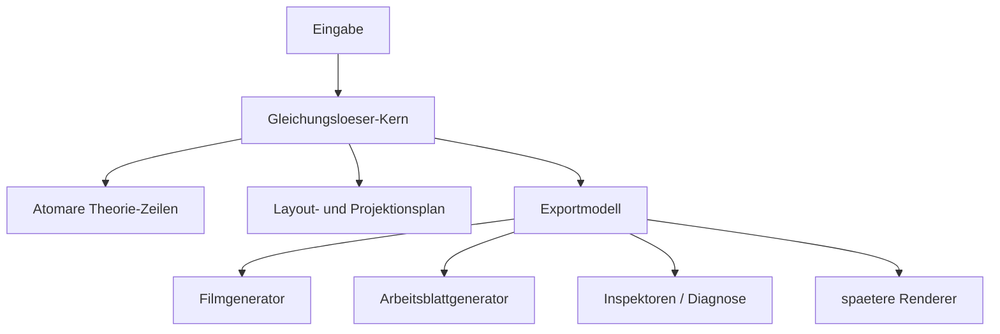

# Kernarchitektur: Der Gleichungsloeser im Zentrum

Status: normativ  
Stand: 5. April 2026

## Zweck
Dieses Dokument beschreibt das Grundmodell des Projekts:
Nicht eine UI, nicht ein Inspektor und nicht ein Exportformat ist das Herz des Systems,
sondern der Gleichungsloeser selbst.

Der Solverkern erzeugt eine kanonische, atomare und logisch nachvollziehbare Beschreibung der Gleichung
ueber alle Zeilen hinweg.
Alles andere dockt daran an.

## Das Zentrum
Im Zentrum steht der produktive Kern unter `core/`.
Er muss drei Dinge zugleich liefern:
1. die atomare Struktur der Gleichung
2. die Logik ihrer Umbauten
3. die positionstreue Projektionsgrundlage fuer Darstellung und Export

Das Herz ist damit nicht nur ein Rechenschritt, sondern ein kanonisches Modell.

## Die Ringe um das Zentrum
### Ring 1: Solve-Kern
- `core/index.js` orchestriert
- `P1_Eingabe` strukturiert die Eingabe atomar
- `P2_Strategie_Analyse` bestimmt den naechsten zulaessigen Schritt
- `P3_Umformung` erzeugt die Theorie-Zeilenfolge
- `P4_Projektion` macht daraus eine positionstreue Setzbasis

### Ring 2: Kanonische Rueckgabe
Der Solve-Kern gibt keine bloesse Endzeile zurueck, sondern ein wiederverwendbares Gesamtmodell:
- Eingabe
- Theorie-Zeilen
- stabile Atom-IDs
- globale Layoutinformation
- positionierte Projektionszeilen
- Exportdaten fuer externe Verbraucher

### Ring 3: Andockende Systeme
Diese Systeme duerfen den Kern nutzen, aber nicht ersetzen:
- Filmgenerator
- Arbeitsblattgenerator
- Diagnose- und Inspektor-Komponenten
- spaetere Renderer oder Editoren

Regel:
Alle diese Systeme konsumieren dieselbe kanonische Kernwahrheit.
Sie erzeugen keine eigene Solver-Realitaet.

## Architekturdiagramm

## Modulliste und Verantwortung
Diese Liste steht bewusst direkt unter dem Zentraldiagramm.
Sie benennt nicht nur die Phasen,
sondern die aktiven Einstiegspunkte des Tabula-rasa-Neustarts.

| Modul | Aktive Datei | Verantwortung |
| :--- | :--- | :--- |
| Runtime-Einstieg | `core/GenesisRuntime/index.js` | exportiert genau den aktiven Einstieg des neuen Kerns |
| Runtime-Pipeline | `core/GenesisRuntime/runtimePipeline.js` | orchestriert `P1 -> P2 -> P3 -> P4`, fuehrt Mehrschritt-Loesungen aus und baut die kanonische Rueckgabehuelle |
| P1 Eingabe | `core/GenesisRuntime/P1_Input/runInputPhase.js` | parst die Eingabe, normalisiert sie und erzeugt die kanonische Anfangsstruktur |
| P2 Strategie | `core/GenesisRuntime/P2_Strategy/runStrategyPhase.js` | waehlt genau den naechsten zulaessigen semantischen Schritt fuer die Zielvariable |
| P3 Umformung | `core/GenesisRuntime/P3_Transformation/runTransformationPhase.js` | setzt genau diese Decision strukturell um und baut die Theorie-History auf |
| P4 Theoriezeilen | `core/GenesisRuntime/P4_Projection/buildTheoryRows.js` | ueberfuehrt Anfangsstruktur und Umbau-History in eine explizite Theoriezeilenfolge |
| P4 Shell-Bedarfsplan | `core/GenesisRuntime/P4_Projection/buildShellBlueprints.js` | meldet vor der Spaltenvergabe alle Kindrollen und Huellezellansprueche ohne Koordinaten |
| P4 Global Semantic Raster | `core/GenesisRuntime/P4_Projection/buildGlobalSemanticRaster.js` und `planGlobalCellPlacement.js` | legt alle Atom-, Huelle- und Zukunftszellen ueber die gesamte Theoriegeschichte genau einmal fest |
| P4 Raster-Feinschliff | `core/GenesisRuntime/P4_Projection/refineSemanticRaster.js` | validiert und schliesst das globale Zellprofil ohne neue Zellansprueche oder Verschiebungen ab |
| P4 Projection Blocks | `core/GenesisRuntime/P4_Projection/buildProjectionBlocks.js` | legt die vertikale Teilzeilenstruktur pro Theoriezeile fest, also Achse, Oberzeilen und Unterzeilen |
| P4 Projection Writer | `core/GenesisRuntime/P4_Projection/writeProjectionRows.js` | schreibt die bereits entschiedene Ortswahrheit als explizite Projektionsatome mit `row`, `col`, `colStart` und `colEnd` aus |
| P4 Output Contract | `core/GenesisRuntime/P4_Projection/buildOutputContract.js` | macht aus der internen Projektionswahrheit die verbindliche Kernschnittstelle fuer Renderer, PDF, Film und Diagnose |
| Medienadapter | `components/*`, `export_projection_pdf*`, spaetere Filmadapter | machen nur sichtbar, was der Kern bereits entschieden hat; sie duerfen keine zweite Orts- oder Solverwahrheit erzeugen |

## Warum das wichtig ist
Wenn der Gleichungsloeser wirklich das Zentrum ist,
dann hat jede Aenderung einen klaren Ort:
- Mathematik und Umbau-Logik im Kern
- Positionstreue im Kern
- Darstellung und Weglassung in Adaptern oder Exportern

So vermeiden wir Kaskaden, bei denen spaetere Ausgabeformen stillschweigend eigene Regeln erfinden.

## Harte Regeln
- Es gibt genau eine kanonische atomare Beschreibung der Gleichung.
- Es gibt genau eine kanonische Umbaugeschichte je Solve-Lauf.
- Exporter, Filmgeneratoren und Arbeitsblattgeneratoren duerfen nur ableiten, nicht neu deuten.
- Weglassungen fuer Arbeitsblaetter sind eine Ausgabeentscheidung, keine Veraenderung der Kernwahrheit.
- Animationen nutzen dieselben IDs und dieselbe Umbaugeschichte wie die statische Ausgabe.

## Konsequenzen fuer den Umbau
- `core/index.js` muss langfristig das volle kanonische Rueckgabeobjekt liefern.
- `P4_Projektion` ist kein Nebenmodul, sondern Pflichtteil des Herzens.
- Export ist kein Add-on am Ende, sondern eine offizielle Kernschnittstelle.
- Diagnose-Komponenten muessen sich an den Core anhaengen, nicht danebenwachsen.
