# Systemkarte: Verantwortungen, Verbote und Datenfluss

Status: operativ-normativ  
Stand: 7. September 2026

Begriffliche Grundlage:
- fuer die verbindliche Sprache rund um `Loesungsschritt`, `Theoriezeile`, `Projektionsblock` und `Teilzeile` siehe `docs/Architecture/BEGRIFFSBLATT_PROJEKTION.md`

## 1. Leitgesetze
1. Der Gleichungsloeser unter `core/` ist das Herz des Projekts.
2. `core/index.js` orchestriert den produktiven Loesefluss.
3. Das System arbeitet normativ in zwei Durchlaeufen: Theorie/Preflight und positionstreuer Setzlauf.
4. Positionstreue ist kein UI-Detail, sondern ein Kernvertrag.
5. IDs sind Anker fuer Export, Zeilenkontinuitaet und Spaetverwendung in Film- oder Arbeitsblattgeneratoren.
6. Diagnose-Komponenten, Filmgeneratoren und Arbeitsblattgeneratoren docken an dieselbe Kernwahrheit an.
7. Funktionale Geometrie entsteht in P4 von innen nach aussen.
8. Renderer bauen daraus visuelle Geometrie und duerfen funktionale Fehler nicht ausgleichen.

## 2. Flussdiagramm

```mermaid
flowchart LR
    A["Gleichung als String"] --> B["P1 Eingabe"]
    B --> C["Strukturzustand mit stabilen IDs"]
    C --> D["P2 Strategie_Analyse"]
    D --> E["Strategieentscheidung"]
    E --> F["P3 Umformung"]
    F --> G["Theorie-Zustaende / Zeilenfolge"]
    G --> H["P4 PreFlight"]
    H --> I["Globale Spalten- und Layoutmatrix"]
    I --> J["P4 funktionale Schalengeometrie bottom-up"]
    J --> K["P4 Setzlauf / Projektion"]
    K --> L["Positionstreue Ausgabe mit Reihen, Spalten, Baendern und Kindern"]
    L --> M["Exportmodell des Gleichungsloesers"]
    M --> N["Renderer: visuelle Geometrie"]
    N --> O["Browser / PDF / Film / Arbeitsblatt"]
```

## 3. Datenwelten
| Ebene | Eigentuemer | Inhalt | Schreiben erlaubt fuer | Verboten |
| :--- | :--- | :--- | :--- | :--- |
| Eingabe | Aufrufer | roher Gleichungsstring | Aufrufer | implizite Normalisierung durch andere Phasen |
| Strukturzustand | `P1` | Atome, Operatoren, Schalen, IDs, Sichtbarkeit | `P1`, spaeter `P3` fuer Markierungen | strategische oder visuelle Deutung in `P1` |
| Strategiezustand | `P2` | naechste erlaubte Aktion | `P2` | Transformation oder Projektion |
| Theorie-Zeilen | `P3` + Orchestrator | Folge von strukturellen Zustaenden ueber den Loesungsweg | `P3`, Orchestrator | visuelles Nachruecken |
| Preflight-Zustand | `P4 PreFlight` | globale Spalten- und Breitenlogik ueber alle Zeilen | `P4` | mathematische Regelanwendung |
| Projektionszustand | `P4 Setzlauf` | funktionale Reihen, Spalten, Achsen, Baender, Schalenkinder, Primitive und Darstellungsform | `P4` | Parserarbeit, neue Strategie oder visuelle Pixelmasse |
| Input-Adapter-Zustand | `components/*/inputAdapter.js` oder spaetere UI-Adapter | normalisierte Vorstufe zur Kernsyntax | jeweiliger Adapter | Solver-Wahrheit oder Strategien erzeugen |
| Exportzustand | Orchestrator + Exportmodell | atomare Theorie, Umbau-Logik, Layout, Ausgabeprofile | `core/index.js`, spaeter Exportadapter | neue Solver-Wahrheit ausserhalb des Kerns |
| Render-Szenenzustand | Schema-Adapter | unveraendert uebersetzte funktionale Geometrie | Adapter nur als Feldabbildung | fehlende Geometrie rekonstruieren oder reparieren |
| UI-/Rendererzustand | `components/*`, Generatoren, Renderer | visuelle Geometrie, Animation, Arbeitsblatt-Varianten, Browserzustand | jeweilige Komponente | funktionale Kernwahrheit definieren oder korrigieren |

## 4. Komponentenmatrix
| Komponente | Muss | Darf lesen | Darf schreiben | Verboten |
| :--- | :--- | :--- | :--- | :--- |
| `core/index.js` | Orchestrierung und kanonische Rueckgabe | `P1` bis `P4` | History, Layoutplan, Rueckgabeobjekt | Fachlogik einer Phase verstecken |
| `P1_Eingabe` | Eingabe strukturieren | Eingabestring | Strukturarray mit stabilen IDs | Strategien oder Projektion |
| `P2_Strategie_Analyse` | naechste Aktion bestimmen | Strukturarray | Strategieobjekt | direkte Umformung |
| `P3_Umformung` | Struktur aendern | Strukturarray, Strategieannahme | Theorie-Zeilen | Layout berechnen |
| `P4_Projektion` | PreFlight, funktionale Geometrie und Setzlauf | Theorie-Zeilen, Anker-IDs | Reihen, Achsen, Baender, Kinder, Primitive, `row`/`col` | neue mathematische Schritte oder visuelle Medienmasse |
| Exportmodell | kanonische Solve-Daten nach aussen abbilden | Theorie- und Projektionszustand | Exportobjekt | eigene Solver-Logik erfinden |
| Schema-Adapter | Vertragsform uebersetzen | Exportmodell | gleichbedeutende Szenenfelder | Geometrie, Fokus oder Kindbeziehungen inferieren |
| `components/*` | Diagnose oder visuelle Ausgabe | Core oder Teil-APIs | Browser-DOM und visuelle Geometrie | Kernzustand normativ veraendern oder Fehler uebermalen |
| Film-/Arbeitsblatt-Generatoren | Ausgabeformen erzeugen | Exportmodell | externe Artefakte und visuelle Geometrie | IDs, Umbaugeschichte, funktionale Geometrie oder Darstellungsform umdeuten |

## 5. Harte Verbote
- `P2` ruft nicht `P3` direkt.
- `P3` bestimmt keine Spaltenlogik.
- `P4` parst keine Eingabe und erfindet keine Mathematik.
- `components/*` pflegen keine zweite Wahrheit neben dem Core.
- Exporter und Generatoren veraendern keine IDs.
- Positionstreue darf nicht durch horizontales Nachruecken zerstoert werden.
- Weglassungen fuer Arbeitsblaetter duerfen nie die Kernwahrheit ueberschreiben.
- Adapter und Renderer rekonstruieren keine Schalen aus Text, Nachbarschaft oder geometrischem Einschluss.
- Visuelle Messungen veraendern keine funktionalen Reihen, Spalten, Achsen oder Baender.

## 6. Wichtige Uebertragbare Lektionen
| Prinzip | Nutzen |
| :--- | :--- |
| Gleichungsloeser als Zentrum | haelt alle Ausgabeformen an derselben Wahrheit |
| Zwei-Durchlauf-Modell | trennt Theorie und Setzrealitaet sauber |
| Stabile IDs als Anker | sichern Export, Zeilenkontinuitaet und Positionstreue |
| Globale Spaltenmatrix | verhindert lokales Nachruecken zwischen Zeilen |
| Komponenten-Doku direkt am Code | reduziert Erklaerungsluecken |
| Komponentenweise Commits | machen Historie pro Baustein nachvollziehbar |
