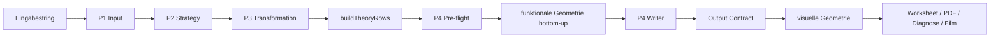

# Genesis Gleichungsloeser Maschine

Status: zentrales normatives Fuehrungsdokument
Stand: 17. September 2026
Rolle heute: maschinennahe Vertragsbeschreibung des gesamten Projekts

## 0. Zweck
Dieses Dokument ist die normative Kurz- und Vertragsfassung des Projekts.

Es soll drei Dinge leisten:

- den aktiven Soll-Zustand des gesamten Systems benennen
- Modulgrenzen und Schnittstellen festhalten
- als Rekonstruktionsgrundlage fuer einen kompletten Neuaufbau taugen

Die verstaendliche Schwester liegt in:

- `docs/Genesis/Genesis_Gleichungsloeser_Mensch.md`

## 1. Kernthese
Der Gleichungsloeser ist ein Struktur-, Umbau-, Projektions- und Ausgabesystem fuer nachvollziehbare algebraische Umformungen.

Er ist nicht:

- ein beliebiges CAS
- ein nur auf Endformen optimierter Rechner
- ein Renderer mit spaeter dazugesetzter Mathematik

Er muss gleichzeitig liefern:

1. kanonische Struktur
2. kanonische Umbaugeschichte
3. kanonische Ortswahrheit

## 2. Systemgesetz
Die Projektverfassung lautet:

1. Es gibt genau eine semantische Ortswahrheit.
2. Diese Ortswahrheit entsteht vollstaendig im Pre-flight von `P4`.
3. Semantische Schachtelung entsteht in `P1` und `P3`.
4. Funktionale Geometrie entsteht in `P4` bottom-up von innen nach aussen.
5. Renderer bauen daraus visuelle Geometrie, aber keine neue funktionale Geometrie.
6. Kein spaeteres Modul darf rekonstruieren, korrigieren oder uebermalen, was ein frueheres Modul haette festlegen muessen.
7. Jede fachliche Entscheidung hat genau einen Modul-Eigentuemer.
8. Neue Grundregeln werden zuerst in Genesis dokumentiert.
9. Bis der Core gruen ist, ist atomare Eins-zu-eins-Ausgabe der verbindliche Renderbeweis.
10. Ein Prozessschritt ist die eine Aufgabe eines Prozessmoduls, nicht eine mathematische Operationsart.
11. Jede aktive Schalenart besitzt genau einen kanonischen Schalenstandard.
12. Jedes Prozessmodul deklariert seinen Umgang mit allen von ihm beanspruchten Situationen.
13. Jede Uebergabe endet entweder in einem vollstaendig gueltigen Vertragszustand oder in einem expliziten Fehler.
14. Zwischen zwei benannten Prozessmodulen ist keine versteckte Fachtransformation zulaessig.
15. Der P4-Pre-flight ermittelt zuerst den vollstaendigen Zellbedarf aller Theoriezeilen und vergibt danach jede horizontale Zelle genau einmal im Global Semantic Raster.
16. Das abgeschlossene Raster enthaelt Atomzellen, Huellezellen und leere Zukunftsreservierungen mit endgueltigem `colStart`, `col` und `colEnd`; alle spaeteren P4-Module sind horizontal schreibgeschuetzte Konsumenten.
17. Erweitert P3 eine Gleichungsseite durch einen neuen Faktor, wird dieser am aeusseren Seitenrand angefuegt: links als Praefix, rechts als Suffix; der vorhandene Ausdruck bleibt gleichheitsnah.
18. Eine obere Huellezeile wird relativ zur vollstaendigen Kindgeometrie gesetzt; der `root_overbar` liegt stets genau eine Relativzeile ueber `minRelativeRow` des Radikanden und darf keine Radikandzeile belegen.
19. Ein dokumentierter Systemwechsel trennt zuerst die funktionale Spaltenvergabe und erst daraus folgend ihre physische Breite: Eine funktionale Zelle ist dort durch `processSpaceId + col` identifiziert. Vor `B` gehoeren alle Zellen zum Raum `a1`; der komplexe Exponent ist an der Boundary genau eine aeussere funktionale Spur. Die atomaren P4-Zellen in dieser geschlossenen `POWER`-Geometrie bleiben sichtbar, ihre dortigen `col`-Werte sind aber keine vorweggenommenen normalen A2-Termspalten. Erst `B` faltet diese eine Spur genau einmal auf und vergibt fuer die geordneten Innenzellen kompakte neue Spalten im Raum `a2`; Landing und alle Folgezeilen von A2 verwenden genau diese neue Vergabe. Keine A2-Zelle darf deshalb in A1 vorreserviert werden und keine alte A1-Potenzspalte darf in A2 fortleben. Der Renderer liest diese Zuordnung nur; die getrennte Breitenberechnung ist eine nachgelagerte Folge. Nur der ausdruecklich gemeinsame Gleichheitsanker koppelt beide Prozessraeume.
20. Ein freier Logarithmus wird im Output niemals als zusammengesetztes Atom wie `log_3` materialisiert. `log`, die Basis `3`, linke Klammer, Argument und rechte Klammer sind getrennte funktionale Zellen derselben `FUNCTION`-Schale. Eine zusammengesetzte Bezeichnung ist ausschliesslich fuer semantischen Vergleich und Diagnose zulaessig.
21. Bridge B uebernimmt die komplette neue `FUNCTION`-Huelle einschliesslich Name, optionaler Basis, beider Klammern, Argumentbereich und Shell-Spanne aus der ersten A2-Projektionszeile. Beim identitaetsbasierten Einsetzen der unveraenderten Boundary-Kindschale werden die gelieferten Praefix- und Suffixabstaende der Huelle exakt an deren funktionale Zellgrenzen gebunden. B darf weder Glyphenbreiten verwenden noch Kopf- oder Klammerzellen aus sichtbarem Text erraten.
22. `U - (V + W + ...) -> U - V - W - ...` ist ein eigener sichtbarer Umformungsschritt der Familie `subtracted_sum_release`. P2 darf ihn nur fuer eine zielvariablenfreie Gleichungsseite und genau die kanonische Lage `SUBTRACTION.subtrahend -> GROUP.content -> ADDITION` waehlen; P3 verteilt genau das eine aeussere Minus ueber die geordneten Summanden. P4 und Renderer duerfen diese Theoriezeile weder erzeugen noch unterschlagen.
23. Die horizontale Huelle einer `FUNCTION` wird bottom-up aus zwei voneinander getrennten Kindbloecken gebildet. Mit Basis gilt strikt `function_name < baseContent < function_left_paren < content < function_right_paren`; ohne Basis entfaellt ausschliesslich `baseContent`. Jeder Vergleich bezeichnet disjunkte funktionale Zellen oder Zellspannen. Insbesondere darf eine Funktionsbasis weder innerhalb des Argumentbands noch rechts von der linken Klammer liegen. Diese Ordnung gehoert dem globalen P4-Zellprofil; Bridge und Renderer duerfen sie nur unveraendert konsumieren.
24. Jede `POWER`-Schale deklariert im P4-Pre-flight genau zwei eigene Basis-Klammer-Slots `power_left_paren` und `power_right_paren`. Sie umschliessen horizontal und vertikal ausschliesslich den vollstaendigen Basisblock; der Exponentenblock der aeusseren Potenz liegt ausserhalb der rechten Klammer. P4 liefert deshalb fuer beide Slots neben ihrer Spalte auch `rowSpanStart` und `rowSpanEnd` aus der fertigen Basisgeometrie. P4 entscheidet aus der kanonischen Basisstruktur, ob beide Slots sichtbar oder explizit eingeklappt sind. Insbesondere ist eine `POWER` als Basis einer weiteren `POWER` sichtbar zu klammern, sodass die Schachtelung `(a^b)^c` eindeutig bleibt. Ein eingeklappter Slot bleibt funktional bekannt, traegt `isVisible = false` und darf physisch nur dann Breite `0` erhalten, wenn keine sichtbare Zelle derselben globalen Spalte Breite benoetigt. Renderer und Adapter duerfen Sichtbarkeit, Spalte, Zeilenspanne oder Klammerbedarf weder aus Text noch aus Nachbarschaft ableiten.
25. Ein Bedienziel fuer Farbe oder Hervorhebung folgt immer exakt der vom Core bestimmten Operandengrenze des Prozessschritts. Ist der bewegte Faktor eine zusammengesetzte Schale, ist die vollstaendige Schale mit allen stabilen sichtbaren Nachfahren genau ein Farbziel. Insbesondere umfasst ein als Kehrbruch bewegter `DIVISION`-Faktor vor dem Schritt Zaehlerschale, Bruchschale und Nennerschale und nach dem Schritt die vollstaendige erzeugte Kehrbruchschale. Cockpit und Renderer duerfen dieses Ziel weder auf ein Blattatom verkuerzen noch aus sichtbarem Text neu erraten.
26. Das Farbziel einer Schalenumkehr folgt der stabilen Herkunftskette von der bezeichneten Quellschale zur durch denselben Prozessschritt erzeugten Gegenschale. Bei `root_power` gehoeren daher die Quell-`POWER`- beziehungsweise Quell-`ROOT`-Schale und die erzeugte inverse `ROOT`- beziehungsweise `POWER`-Schale zum selben Schrittziel. Eine erzeugte `ROOT` ist ueber ihre Schalen-ID zu adressieren; dadurch erhalten `root_hook` und `root_overbar` zwingend gemeinsam dieselbe Farbe, waehrend der Radikand seine eigenen Farbziele behaelt. Veraltete Darstellungsmerkmale wie `visualMode = INVERSE_SHELL` duerfen nicht zur Wiederherstellung dieser Core-Beziehung benutzt werden.
27. Ein reines Funktionshuellen-Farbziel umfasst ausschliesslich die vorhandenen Huelleprimitive der Funktion, insbesondere Funktionsname, optionale Basis und Klammern. Das Argument bleibt ein eigener Operand und darf durch die Farbe einer Funktionsumkehr nicht implizit mitgefaerbt werden. Bei `trig_inverse` und `inverse_trig` werden deshalb die atomaren Huelleprimitive der bezeichneten Quellfunktion und der erzeugten inversen Funktion ueber deren stabile Quellatom-Identitaet adressiert; ein breiter `shell-id`-Selektor auf die FUNCTION-Schale ist fuer dieses Ziel verboten. Wird das Argument zugleich als Zielvariable gefaerbt, entscheidet ausschliesslich dessen eigener Zielselektor ueber seine Farbe.
28. Wird bei `fraction_birth` eine bereits als einzelne sichtbare `DIVISION` vorliegende Gegenseite durch einen passiven Nicht-Bruch-Faktor geteilt, darf keine aeussere zweite `DIVISION` entstehen. `P2` muss die Situation als `inverseMode = extend_existing_denominator` entscheiden und die vorhandene Divisions-ID benennen. `P3` erzeugt genau eine neue `DIVISION`: Der vorhandene Zaehler bleibt unveraendert, der vorhandene Nenner wird durch eine `MULTIPLICATION` um den neuen Faktor erweitert. Diese Nennererweiterung folgt demselben Aussenanlagerungsgesetz wie jede neue Multiplikation: auf der linken Gleichungsseite steht der neue Faktor vor dem bisherigen Nenner, auf der rechten dahinter. Vorhandene Kind-IDs und ihre Reihenfolge bleiben erhalten; die neue Divisionsschale referenziert ihre Herkunft explizit. Ist der bewegte Faktor selbst eine `DIVISION`, gilt stattdessen weiterhin vorrangig die Kehrbruchregel. P4 und Renderer duerfen weder einen Doppelbruch glatten noch die Nennererweiterung selbst erfinden.
29. Eine numerische Spalte ist innerhalb einer mehrzeiligen Schale keine Elementidentitaet. Zellen in Zaehler, Schalenachse und Nenner duerfen dieselbe Spaltennummer auf verschiedenen lokalen Zeilen tragen. Bridge B bindet deshalb jede uebernommene Zelle ueber ihre Atom- beziehungsweise Schalenidentitaet und bildet Shell-Spannen aus den gebundenen Kindidentitaeten ab; eine globale Abbildung `Quellspalte -> Zielspalte` ist verboten. Auf der unveraenderten Durchreicheseite bleiben die vollstaendigen A1-Zellen exakt stehen. Eine bei der Landung neu hinzukommende aeussere `FUNCTION`-Huelle erhaelt ihre eigenen Slots aus dem A2-Landing-Profil relativ zu dieser unveraenderten Kindschale. Ihre kanonischen P4-Rollen `function_name`, `function_left_paren` und `function_right_paren` bleiben von der B-Landung bis in jede unveraenderte A2-Folgezeile identisch; B darf eine identitaetstragende Rolle weder umbenennen noch durch eine Darstellungsrolle ersetzen. Nur der geoeffnete Exponenteninhalt erhaelt die ausdruecklich vereinbarten neuen A2-Termslots. Weder Bridge B noch ein Renderer darf Spaltenmehrdeutigkeit durch Auswahl, Mittelung oder optische Korrektur aufloesen.

## 3. Hauptobjekte

### 3.1 Atom
Identitaetsstabile semantische Grundeinheit.

Typisch:

- `NUMBER`
- `VARIABLE`
- `OPERATOR`
- `ANCHOR`

### 3.2 Schale
Strukturelle Huelle ueber Inhalt.

Typisch:

- `GROUP`
- `FUNCTION`
- `ROOT`
- `POWER`
- `NEGATION`
- `DIVISION`
- `MULTIPLICATION`
- `ADDITION`
- `SUBTRACTION`

Normative Praezisierung:

- eine Schale kann algebraisch geschlossen sein und trotzdem projektionell voll sichtbar bleiben
- "geschlossen" bedeutet nur, dass `P2` und `P3` sie im aktuellen Umformungsschritt als Einheit behandeln
- daraus folgt ausdruecklich nicht, dass `P4` oder ein Renderer ihren Inneninhalt zu einem Einzelblock verdichten duerfen
- beim spaeteren Oeffnen einer Schale entstehen keine neuen Innen-Spalten; es wird nur eine bereits vorhandene Innenordnung wieder algebraisch adressierbar

### 3.3 Theoriezeile
Ein vollstaendiger semantischer Gleichungszustand eines Solve-Laufs.

### 3.4 Projektionszeile
Eine Theoriezeile nach Uebersetzung in explizite Ortswahrheit.

### 3.5 Output Contract
Die einzige verbindliche Kernschnittstelle fuer Renderer, PDF, Diagnose und spaetere Filmadapter.

### 3.6 Kanonische Operationsschale

`GROUP`, `FUNCTION`, `ROOT`, `POWER`, `NEGATION`, `DIVISION`,
`MULTIPLICATION`, `ADDITION` und `SUBTRACTION`
sind kanonische semantische Schalen.

P1 erzeugt fuer jede Eingabeoperation bereits die vollstaendige zielunabhaengige Schale.
Ein P1-Ergebnis mit losen Operanden und Operatoren anstelle einer Operationsschale ist unvollstaendig.
Ziel-, Passiv- und Flussrollen gehoeren nicht zur intrinsischen Schale,
sondern werden erst durch P2 fuer genau eine Decision bezeichnet.

`COLLECTION` ist keine Operations- und keine Eingabeschale.
Sie ist eine kanonische, ausschliesslich durch P3 erzeugte Transportschale
fuer einen semantisch unveraenderten Kindverband.
Die Runtime-Pipeline, P1, P2 und Renderer duerfen keine `COLLECTION` erzeugen.

### 3.7 Funktionale Geometrie

Medienneutrale Geometrie des Core:

- semantische Eltern-Kind-Schachtelung als Vorbedingung
- Spuren und Teilzeilen
- Achsen
- Inhalts-, Ausrichtungs- und Huellebaender
- sichtbare Huelleprimitive und ihre funktionalen Spannen
- explizite Darstellungsform pro Schale und Theoriezeile

### 3.8 Visuelle Geometrie

Physische Abbildung der funktionalen Geometrie durch einen Renderer:

- Pixel-, `em`- oder Papiermasse
- Fontmetriken
- Zeichenpfade
- Strichstaerke, Farbe und Skalierung

Visuelle Geometrie darf funktionale Geometrie nicht veraendern.

### 3.9 Geburtsgeometrie

Die funktionale Geometrie einer sichtbaren Schale
bei ihrem ersten sichtbaren Auftreten.

Sie wird bottom-up aus bereits fertigen Kindern aufgebaut
und danach bei unveraenderter Schale nur als Ganzes transportiert.

### 3.10 Atomarer Renderbeweis

Verbindliche Baseline fuer jede sichtbare P4-Ausgabe:

```text
1 sichtbares projectionAtom
-> 1 Worksheet-Zelle
-> 1 Display-Item
-> 1 visuelles Primitiv
```

Unveraendert zu transportieren sind mindestens:

- Quell-ID und Projektionsrolle
- `rowId` und `localRow`
- `col` oder `colStart + colEnd`
- Sichtbarkeit und explizite Darstellungsform

In diesem Referenzmodus sind Aggregation,
Zellersatz,
Verbrauch,
Unterdrueckung,
funktionale Neuzentrierung
und synthetische Ergaenzung verboten.

Ein Renderer darf nur die einheitliche Rasterabbildung,
Font,
Farbe
und Strichstaerke hinzufuegen.
Fehlende Pflichtdaten machen die Uebergabe ungueltig.

Ein spaeterer typografischer Renderer ist nur eine weitere visuelle Abbildung.
Er braucht einen eigenen Aequivalenzbeweis gegen diese atomare Baseline.

### 3.11 Prozessschritt und Prozessmodul

Ein `Prozessschritt` ist genau eine fachliche Aufgabe in der Pipeline.
Genau ein `Prozessmodul` besitzt diese Aufgabe.

Pflichtform:

```text
benannter Vorgaenger
-> versionierter Eingabevertrag
-> genau eine Modulaufgabe
-> versionierter Ausgabevertrag
-> benannter Nachfolger
```

Ein Umformungsschritt zwischen zwei Theoriezeilen ist davon verschieden:
`P2` waehlt die Umformungsentscheidung,
`P3` setzt sie um.

### 3.12 Schalenstandard und Situation

Ein `Schalenstandard` definiert ausschliesslich intrinsische Aussagen einer Schalenart:

- Typ und Bedeutung
- Kinder, Rollen, Reihenfolge und Kardinalitaet
- Identitaet, Herkunft und Sichtbarkeitszustaende
- Invarianten und ungueltige Formen
- funktionaler Beitrag zur umgebenden Schale

Eine `Situation` ist eine explizite Kombination aus strukturierten Vertragsmerkmalen,
zum Beispiel Schalentyp, Zielrolle, Gleichungsseite und Sichtbarkeitszustand.
Sie wird nie aus Rendertext oder Nachbarschaft geraten.

### 3.13 Fallregel

Eine `Fallregel` gehoert genau einer Modulrichtlinie.
Sie beschreibt,
wie dieses Prozessmodul seine eine Aufgabe in einer bestimmten Situation ausfuehrt.

Pro beanspruchter Situation gilt:

- genau eine passende Regel: ausfuehren
- keine passende Regel: explizit `nicht unterstuetzt` oder vertraglich definierter Endzustand
- mehrere passende Regeln: Mehrdeutigkeitsfehler

Geordnete Regeln sind nur zulaessig,
wenn ihre Reihenfolge fachlicher Vertragsbestandteil ist
und als solche getestet wird.

## 4. Gesamtprozess


## 5. Vollstaendige Uebergabekette
Diese Kette beschreibt den gesamten produktiven Ablauf
in der Reihenfolge der realen Uebergaben.

| Nr. | Von | Nach | Uebergibt | Aufgabe des empfangenden Prozessmoduls |
| :--- | :--- | :--- | :--- | :--- |
| 1 | Cockpit oder Script | Runtime-Pipeline | Gleichung, Zielvariable, Optionen | startet und orchestriert den Solve-Lauf, ohne Fachzustaende zu veraendern |
| 2 | Runtime-Pipeline | `P1` | Rohauftrag | erzeugt die vollstaendige zielunabhaengige Anfangsstruktur |
| 3 | `P1` | `P2` | kanonische Anfangsstruktur | waehlt genau eine Umformungsentscheidung oder einen definierten Endzustand |
| 4 | `P2` | `P3` | unveraenderte Struktur plus genau eine Decision | fuehrt genau diese Decision strukturell aus |
| 5 | `P3` | `P2` | genau eine neue kanonische Struktur plus History-Eintrag | waehlt auf der neuen Struktur die naechste Decision; 4 und 5 wiederholen sich |
| 6 | Runtime-Pipeline | `buildTheoryRows` | Anfangsstruktur plus abgeschlossene History | baut die vollstaendige unveraenderte Theoriezeilenfolge |
| 7 | `buildTheoryRows` | Shell Blueprints | geordnete Theoriezeilen | ermittelt fuer jede sichtbare Schale ihren strukturellen Zellbedarf ohne Spalten |
| 8 | Shell Blueprints | Global Semantic Raster | Theoriezeilen plus vollstaendiger Zellbedarf | vergibt fuer Atome, Huelleprimitive und Zukunftsreservierungen genau einmal die endgueltigen horizontalen Zellen |
| 9 | Global Semantic Raster | Raster-Feinschliff | vollstaendiges globales Zellprofil | validiert und schliesst die eine horizontale Ortswahrheit ab, ohne neue Zellansprueche zu erfinden |
| 10 | Raster-Feinschliff | funktionale Profilmaterialisierung | feste Zellen plus strukturelle Schalenplaene | materialisiert die bereits bottom-up geplanten Zell- und Banddaten ohne horizontale Aenderung |
| 11 | Funktionale Schalengeometrie | Projection Blocks | vollstaendige funktionale Schalen- und Kindgeometrie | bestimmt die daraus folgende vertikale Block- und Teilzeilenstruktur |
| 12 | Projection Blocks | Projection Writer | vollstaendige funktionale Ortswahrheit | schreibt sie unveraendert als Projektionsatome und Schalenauftreten aus |
| 13 | Projection Writer | Output Contract | fertige Projektionszeilen und Geometrieobjekte | verpackt und validiert die einzige funktionale Kernschnittstelle |
| 14 | Output Contract | Schema-Adapter | verbindliche Kernwahrheit | uebersetzt ausschliesslich Feldnamen und Versionen |
| 15 | Schema-Adapter | Renderer | unveraendert uebersetzte funktionale Geometrie | bildet sie in Pixel, `em` oder Papiermasse ab |
| 16 | Renderer | Browser, PDF, Cockpit, Film | visuelle Geometrie | zeichnet die bereits bestimmten sichtbaren Primitive |

Normativer Kernsatz:

1. `P1` uebergibt Struktur.
2. `P2` uebergibt Decision.
3. `P3` uebergibt Theorie-History.
4. `P4` uebergibt Ortswahrheit und funktionale Geometrie.
5. Adapter reichen schemafest weiter.
6. Renderer bauen daraus visuelle Geometrie.

Jeder Pfeil dieser Kette ist ein expliziter Uebergabevertrag.
Die Uebergabe wird in derselben Vertragsdefinition geprueft,
die auch der zugehoerige Grenztest verwendet.
Der Empfaenger darf ungueltige Eingabe nicht reparieren.
Die Runtime-Pipeline darf nur Reihenfolge, Wiederholung, Abbruch und Fehlertransport orchestrieren;
sie darf zwischen den benannten Modulen keine semantische Normalisierung einschieben.

## 6. Hauptphasen

### 6.1 P1 Input
Aktive Zone:

- `core/GenesisRuntime/P1_Input/`

Verantwortung:

- Eingabe lesen
- kanonisieren
- Atome, Schalen, Anker und IDs bauen

Darf nicht:

- Strategie waehlen
- Struktur umformen
- Ortswahrheit festlegen

### 6.2 P2 Strategy
Aktive Zone:

- `core/GenesisRuntime/P2_Strategy/`

Verantwortung:

- aktive Seite bestimmen
- Zielvariable pruefen
- genau eine zulaessige Familienentscheidung liefern

Darf nicht:

- Struktur veraendern
- inverse Schalen bauen
- Layout beantworten

### 6.3 P3 Transformation
Aktive Zone:

- `core/GenesisRuntime/P3_Transformation/`

Verantwortung:

- die Decision aus `P2` strukturell umsetzen
- Theorie-History erzeugen
- inverse Gegenschalen und Sichtbarkeitswechsel abbilden
- bei neu erzeugten Gleichungsseiten-Produkten die Faktorenfolge allein aus der
  Seite des erzeugten Produkts bestimmen:
  - erzeugte Seite `left`: `[neuer Faktor, vorhandener Ausdruck]`
  - erzeugte Seite `right`: `[vorhandener Ausdruck, neuer Faktor]`
- die Seite des erzeugten Produkts explizit an den zentralen Produktschalen-Erzeuger uebergeben

Darf nicht:

- Strategie neu bestimmen
- Spalten, Achsen, Slotbreiten oder Renderorte entscheiden
- fuer fehlende Seiteninformation eine Standard-Faktorreihenfolge raten

### 6.4 P4 Projection
Aktive Zone:

- `core/GenesisRuntime/P4_Projection/`

Verantwortung:

- gesamte Theorie-History lesen
- daraus die einzige Ortswahrheit erzeugen
- funktionale Schalengeometrie bottom-up aus der bekannten Schachtelung bauen
- Geburtsgeometrie unveraenderter Schalen als Ganzes transportieren
- diese Wahrheit als explizite Projektionsstruktur ausschreiben
- den Output Contract fuer alle Medien bauen

Darf nicht:

- mathematische Strategie neu entscheiden
- Mediensonderregeln in den Kern mischen

## 7. Interne Kette von P4

### 7.1 Theoriezeilenaufbau
Datei:

- `core/GenesisRuntime/P4_Projection/buildTheoryRows.js`

Aufgabe:

- Anfangsstruktur und History in eine vollstaendige Theoriezeilenfolge ueberfuehren

### 7.2 Shell Blueprints
Datei:

- `core/GenesisRuntime/P4_Projection/buildShellBlueprints.js`

Aufgabe:

- vor der Spaltenvergabe den strukturellen Zellbedarf jeder sichtbaren Schale beschreiben
- Kindrollen und benoetigte Huelleprimitive ohne horizontale Koordinaten ausgeben

### 7.3 Global Semantic Raster
Dateien:

- `core/GenesisRuntime/P4_Projection/buildGlobalSemanticRaster.js`
- `core/GenesisRuntime/P4_Projection/planGlobalCellPlacement.js`
- `core/GenesisRuntime/P4_Projection/refineSemanticRaster.js`
- `core/GenesisRuntime/P4_Projection/shellLayoutRules.js` als reine Regelbibliothek

Aufgabe:

- aus dem vollstaendigen strukturellen Zellbedarf alle Atom-, Huelle- und Zukunftszellen ueber alle Zeilen bestimmen
- `colStart`, `col` und `colEnd` jeder funktionalen Zelle im Pre-flight genau einmal endgueltig festlegen
- pro Theoriezeile belegte und freigehaltene Rasterbereiche explizit ausgeben

### 7.4 Funktionale Profilmaterialisierung

Datei:

- `core/GenesisRuntime/P4_Projection/localizeProjectionGeometry.js`

Fuehrende Richtlinie:

- `docs/Genesis/Neustart_2026-07-28/MODULES/06_FUNKTIONALE_SCHALENGEOMETRIE.md`

Aufgabe:

- das abgeschlossene globale Zellprofil auf Vollstaendigkeit gegen Theoriezeilen und Blueprints pruefen
- die bereits fertigen Inhaltszellen und lokalisierten Blueprints unveraendert fuer Projection Blocks und Writer materialisieren
- niemals `colStart`, `col` oder `colEnd` erzeugen oder veraendern

Darf nicht:

- Kindzugehoerigkeit neu entscheiden
- bereits geborene Schalen zeilenweise neu zentrieren
- Pixel-, Font- oder Medienmasse erzeugen

### 7.5 Projection Blocks
Dateien:

- `core/GenesisRuntime/P4_Projection/buildProjectionBlocks.js`
- `core/GenesisRuntime/P4_Projection/projectionTraversal.js`

Aufgabe:

- vertikale Teilzeilenstruktur, Achse, Ober- und Unterzeilen bestimmen

### 7.6 Projection Writer
Datei:

- `core/GenesisRuntime/P4_Projection/writeProjectionRows.js`

Aufgabe:

- bereits entschiedene Ortswahrheit als explizite Projektionsatome ausschreiben

### 7.7 Output Contract
Datei:

- `core/GenesisRuntime/P4_Projection/buildOutputContract.js`

Aufgabe:

- eine verbindliche Kernschnittstelle fuer alle Verbraucher bereitstellen

Normativer Zusatz:

- sichtbare Innenatome und sichtbare Schalen werden getrennt ausgeliefert
- funktionale Schalengeometrie wird nicht aus spaet rekonstruierter Textform abgeleitet
- der Core liefert eine explizite sichtbare Darstellungsform, damit Verbraucher weder selbst buendeln noch doppelt zeichnen
- spaetere Medien bauen visuelle Geometrie nur aus der vom Core exportierten funktionalen Geometrie
- sichtbare Brueche folgen dem Teilvertrag `docs/Architecture/BRUCH_VERTRAG_V2.md`
- sichtbare Wurzeln folgen dem Teilvertrag `docs/Architecture/WURZEL_VERTRAG_V1.md`

## 8. Aktive Modulkarte des Gesamtprojekts

Die vollstaendige verbindliche Zuordnung steht in:

- `docs/Genesis/Neustart_2026-07-28/MODULE_MATRIX.md`

Ein aktives Modul besitzt zwingend:

```text
genau eine fuehrende Richtlinie
+ genau einen verantwortlichen Codepfad
+ mindestens einen im Standardlauf registrierten Test
+ einen getrennt ausgewiesenen gruenen oder roten Beweisstatus
```

| Schicht | Aktive Datei oder Zone | Aufgabe | Statusart |
| :--- | :--- | :--- | :--- |
| Runtime-Einstieg | `core/GenesisRuntime/index.js` | aktiver Einstieg des neuen Kerns | aktiv |
| Runtime-Pipeline | `core/GenesisRuntime/runtimePipeline.js` | orchestriert `P1 -> P2 -> P3 -> P4` | aktiv |
| Input | `core/GenesisRuntime/P1_Input/` | Parsing und Normalisierung | aktiv |
| Strategy | `core/GenesisRuntime/P2_Strategy/` | naechste zulaessige Umformungsentscheidung | aktiv |
| Transformation | `core/GenesisRuntime/P3_Transformation/` | struktureller Umbau | aktiv |
| Projection (Phasencontainer) | `core/GenesisRuntime/P4_Projection/` | ordnet die einzelnen P4-Prozessmodule fuer Ortswahrheit, funktionale Geometrie und Exportvertrag | aktiv |
| FractionNeustart | `core/GenesisRuntime/FractionNeustart/` | isolierter Neubau fuer Bruchgeburt und Transport | isolierter Neubau |
| Core A | `core_a/` | Ziel- und Vertragsfassade auf den aktiven Kern | Migration |
| Bridge B | `bridge_b/transition_step/` | genau ein kontrollierter Systemwechsel | isoliert aktiv |
| Contracts | `contracts/` | versionierte Austauschformate ohne Fachlogik | aktiv je Vertrag |
| Render-Scene-Adapter | `core_a/adapters/render_scene/` | schemafeste Uebersetzung der Kernwahrheit | Migration |
| Renderer-Kernel | `renderer_kernel/` | visuelle Geometrie aus funktionaler Geometrie | teilweise Migration |
| Worksheet-Adapter | `components/Arbeitsblatt_Druckansicht/viewModel.js` | Kernprojektionsdaten schemafest in Worksheet-Modell ueberfuehren | produktiv |
| Render-Kern | `components/Arbeitsblatt_Druckansicht/renderKernelCore/` | visuelle Renderknoten und Metriken bauen | produktiv |
| Column Layout | `components/Arbeitsblatt_Druckansicht/columnLayoutCore/` | funktionale Spuren in physische Display-Slots abbilden | produktiv |
| PDF-Exporter | `scripts/export_projection_pdf_core/`, `scripts/export_projection_pdf.mjs` | visuelle PDF- und Diagnoseausgabe | produktiv |
| Cockpit | `index.html`, `cockpit.js`, `cockpit.css`, `scripts/cockpit_server.mjs` | produktive Bedienhuelle | produktiv |

Vorbereitete Ordner ohne Implementierung oder registrierten Test
sind `geplant` und duerfen nicht als aktive Module bezeichnet werden.

## 9. Kernschnittstellen

### 9.1 Eingabe von P1
Minimal:

- `equation`
- optional `requestedTargetVariable`

### 9.2 Ausgabe von P1
Minimal:

- normalisierte Gleichung
- Namespace oder ID-Quelle
- kanonische Struktur mit genau einer Ausdruckswurzel pro Gleichungsseite
- genau ein Gleichheitsanker zwischen beiden Seiten
- jede Eingabeoperation bereits als zielunabhaengige kanonische Schale
- keine `COLLECTION`

### 9.3 Ausgabe von P2
Minimal:

- Zielvariable
- aktive Seite
- `nextDecision`

### 9.4 Ausgabe von P3
Minimal:

- `initialStructure`
- `nextStructure`
- `history[]`

### 9.5 Ausgabe von P4
Minimal:

- `theoryRows`
- `semanticRaster`
- `shellBlueprints`
- funktionale Geburts- und Transportgeometrie der sichtbaren Schalen
- `projectionBlocks`
- `projectionRows`
- `traceIndex`
- `layoutPlan`
- explizite sichtbare Darstellungsrollen fuer atomare Primitive oder geschlossene Bloecke

## 10. Medienkette

### 10.1 Worksheet
Aktive Zone:

- `components/Arbeitsblatt_Druckansicht/`

Rolle:

- den Output Contract in ein renderbares Arbeitsblattmodell uebersetzen

Normativer Zusatz:

- keine zweite Innenstruktur fuer sichtbare Schalen rekonstruieren
- keine zweite Wurzel-, Klammer- oder Bruchwahrheit erzeugen
- keine fehlenden funktionalen Baender oder Kinder aus Text ableiten
- im atomaren Referenzmodus jedes sichtbare Projektionsatom genau einer Zelle zuordnen
- keine Zelle wegen einer aeusseren Schale unterdruecken oder durch einen Gesamtblock ersetzen
- bei `POWER` die gelieferten Rollen `power_base` und `power_exponent` getrennt,
  sichtbar und mit unveraenderter Teilzeile, Spalte und Spanne weiterreichen

### 10.2 Column Layout
Aktive Zone:

- `components/Arbeitsblatt_Druckansicht/columnLayoutCore/`

Rolle:

- semantische Spalten in physische Display-Slots uebersetzen
- sichtbare Shell-Tinte und semantische Inhaltsbreite sauber trennen

Normativer Zusatz:

- funktionale Geometrie ist nicht visuelle Geometrie
- physische Breiten und Hoehen duerfen aus dem globalen Renderprofil und den gelieferten funktionalen Spuren entstehen
- aus physischen Messungen duerfen keine neuen Kinder, Baender, Reihen oder Achsen entstehen
- im atomaren Referenzmodus darf die physische Breitenabbildung keine funktionale Spanne veraendern

### 10.3 PDF
Aktive Zone:

- `scripts/export_projection_pdf_core/`
- `scripts/export_projection_pdf.mjs`

Rolle:

- aus derselben funktionalen Geometrie die visuelle PDF-Geometrie bauen
- keine funktionale Geometrie im LaTeX-Pfad rekonstruieren oder ausgleichen

### 10.4 Cockpit
Aktive Zone:

- `index.html`
- `cockpit.js`
- `cockpit.css`
- `scripts/cockpit_server.mjs`

Rolle:

- produktive Bedienoberflaeche fuer Gleichung, Zielvariable, Vorschau, PDF und Farbsteuerung
- Zeilenausblendung nur als Sichtbarkeitsregel; Schrittfolge, Zeilenplatz und Zeilenhoehe bleiben aus dem Kern erhalten

### 10.5 Film
Status:

- Zielmedium, noch nicht vollstaendig ausgebaut

Rolle:

- dieselben Atome, dieselben Schalen, dieselbe Umbaugeschichte animieren

## 11. Harte Verbote

### 11.1 Verbotene Vermischung

- `P1` beantwortet keine Strategien
- `P2` fuehrt keine Umbauten aus
- `P3` beantwortet keine Layoutfragen
- `P4` ueberlaesst keine semantischen Ortsfragen spaeteren Medien
- Medienadapter erzeugen keine zweite Kernwahrheit
- Renderer erzeugen keine zweite funktionale Geometrie
- Orchestratoren und Hilfsdateien erzeugen keine semantischen Zwischenzustaende ausserhalb eines benannten Prozessmoduls
- Fallregeln einer Operationsart beanspruchen keine Aufgaben mehrerer Prozessmodule

### 11.2 Verbotene Rekonstruktion
Wenn ein spaeteres Modul:

- Brueche neu erraten
- Schalen neu erkennen
- Spalten neu zuordnen
- nachtraeglich zentrieren, um Kernfehler zu kaschieren
- funktionale Schalenhoehen oder -baender aus Textserialisierung, Glyphenmessung oder alten Zeilen erzeugen

muss, ist die Kette verletzt.

### 11.3 Verbotene Zweitrealitaet
Cockpit, Renderer, PDF und Film duerfen nicht jeweils ihre eigene mathematische oder semantische Wahrheit aufbauen.

Das Cockpit darf insbesondere fuer eine einzelne Umformungsfamilie
kein eigenes alternatives Worksheet-Ergebnis erzeugen.

Eine ausdruecklich vertraglich aktivierte Kette `A1 -> B -> A2`
darf vor der Medienuebergabe ein neues kanonisches Gesamtergebnis liefern.
Das Cockpit konsumiert dieses Ergebnis unveraendert.
Bei `B` endet die alte `POWER`-Spaltenwelt an der Boundary-Zeile;
die Landing-Zeile besitzt kompakte normale Termslots,
die fuer alle folgenden A2-Zeilen verbindlich sind.

### 11.4 Verbotene Renderaggregation vor Core-Freigabe

Solange ein vorgelagerter Core- oder Uebergabevertrag rot ist,
darf der Referenzrenderer keine Core-Zellen zusammenfassen,
ersetzen,
unterdruecken
oder durch rekonstruierten Formelinhalt ergaenzen.

### 11.5 Verbotene Testluecke

Eine Datei unter `tests/active/`,
die der Standard-Testlauf nicht ausfuehrt,
gilt nicht als Modulnachweis.

Ein Modul ohne registrierten Test ist nicht vollstaendig aktiv.

## 12. Rekonstruktionsreihenfolge
Wenn das Projekt neu aufgebaut werden muss, ist die Reihenfolge normativ:

1. Genesis und Dokumentenhierarchie
2. kanonisches Schalenregister und Schalenstandards
3. Prozessmodulrichtlinien, Uebergabevertraege und Situationsmatrizen
4. zugeordnete Testvertraege und Grenztests
5. kanonische Eingabestruktur
6. Zielvariablen- und Umformungsentscheidungen
7. strukturelle Umbauten
8. Theorie-History
9. P4 Pre-flight
10. funktionale Schalengeometrie bottom-up
11. P4 Writer
12. Output Contract
13. Schema-Adapter
14. visuelle Renderer und Column-Layout
15. Worksheet und PDF
16. Cockpit
17. Film

Die umgekehrte Reihenfolge ist ausdruecklich falsch.

## 13. Aktive Fuehrungsdokumente
Diese Maschinenfassung steht nicht allein.
Sie wird durch folgende aktive Dokumente konkretisiert:

- `docs/Genesis/Genesis_Gleichungsloeser_Mensch.md`
- `docs/Genesis/Neustart_2026-07-28/README.md`
- `docs/Genesis/Neustart_2026-07-28/TABULA_RASA_MANDAT.md`
- `docs/Genesis/Neustart_2026-07-28/PHASENKETTE_P1_BIS_RENDERER.md`
- `docs/Genesis/Neustart_2026-07-28/PROZESSMODELL_UND_SCHALENSTANDARD.md`
- `docs/Genesis/Neustart_2026-07-28/MODULE_MATRIX.md`
- `docs/Genesis/Neustart_2026-07-28/MODULES/`
- `docs/Architecture/KERNARCHITEKTUR.md`

Bei Widerspruechen gilt die Reihenfolge:

1. `Genesis_Gleichungsloeser_Mensch.md`
2. `Genesis_Gleichungsloeser_Maschine.md`
3. Genesis-Neustart-Anhaenge
4. lokale Modulrichtlinie
5. weitere Architektur- und Statusdokumente

Aktuelle Detailvertraege muessen auf Genesis zurueckgefuehrt sein.
Dazu gehoeren insbesondere:

- `docs/Architecture/BRUCH_VERTRAG_V2.md`
- `docs/Architecture/WURZEL_VERTRAG_V1.md`
- `docs/Architecture/BRIDGE_B_VERTRAG_V1.md`
- `contracts/*/README.md`

## 14. Modul-Definition-of-Done

Ein Modul ist nur dann freigegeben,
wenn alle Aussagen wahr sind:

1. Seine Richtlinie steht nicht im Widerspruch zu Genesis.
2. Vorgaenger, Eingabevertrag, genau eine Aufgabe, Ausgabevertrag und Nachfolger sind benannt.
3. Genau ein Codepfad besitzt seine Entscheidung.
4. Seine Situationsmatrix weist jede beanspruchte Schalenart als `unterstuetzt`, `durchreichen` oder `zurueckweisen` aus.
5. Jede referenzierte Schalenart besitzt einen kanonischen Schalenstandard.
6. Mindestens ein aktiver Test prueft Aufgabe, Situationen, Uebergabe und Verbotsgrenze.
7. Dieser Test ist im Standard-Runner registriert.
8. Der heutige Testlauf ist gruen.
9. Direkte Nachbarmodule bleiben mit ihren Schutztests gruen.

## 15. Schlussnorm
Das Projekt ist korrekt beschrieben, wenn folgende Aussage gilt:

Eine lueckenlose Kette eindeutig zustaendiger Prozessmodule erzeugt aus einer Gleichung eine kanonische Umbaugeschichte und baut daraus von innen nach aussen genau eine funktionale Orts- und Schalengeometrie; jede Uebergabe ist vollstaendig oder scheitert sichtbar, und Renderer bilden daraus visuelle Geometrie, ohne die funktionale Wahrheit neu zu erfinden oder zu reparieren.
