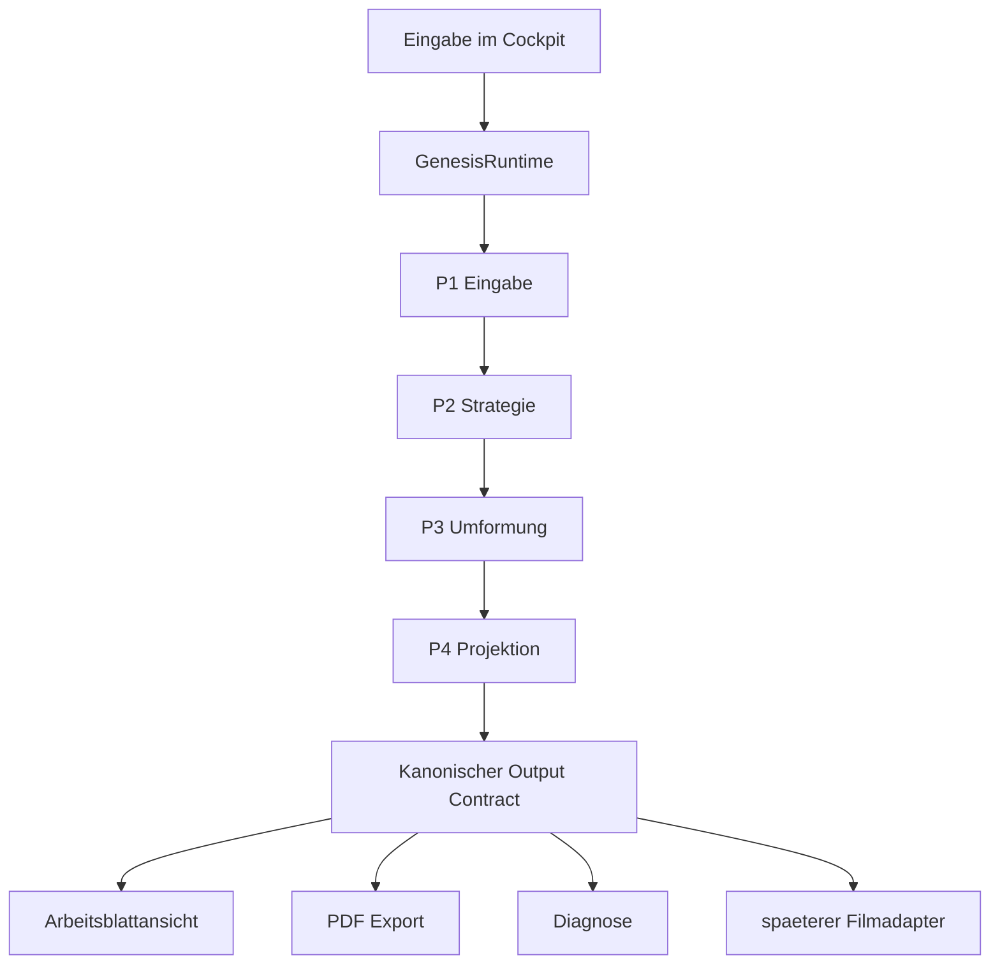

# Genesis Gleichungsloeser Mensch

Status: zentrales Fuehrungsdokument
Stand: 16. September 2026
Rolle heute: verstaendliche Bauanleitung und Rekonstruktionsdokument fuer das gesamte Projekt

## 0. Warum dieses Dokument zentral ist
Dieses Dokument soll wieder genau das leisten, was frueher "Genesis" leisten sollte:

- das ganze Projekt in einer einzigen, zusammenhaengenden Erzaehlung beschreiben
- den Sinn der Module erklaeren
- die harten Regeln festhalten
- den aktiven Projektzustand benennen
- als Grundlage fuer einen kompletten Neuaufbau taugen

Wenn der Code verloren ginge, muesste man mit diesem Dokument,
der Maschinenfassung und den verlinkten Anhaengen
das Projekt in sauberer Form neu bauen koennen.

Es ist also nicht nur Begleittext.
Es ist die Bauanleitung des Projekts.

### 0.1 Dokumentation kommt vor Code

Wenn eine neue Regel,
eine bessere Trennung
oder ein neuer Vertrag entsteht,
wird zuerst geprueft,
ob Genesis diese Wahrheit bereits traegt.

Wenn nicht,
wird zuerst Genesis berichtigt.
Danach folgen die lokale Modulrichtlinie,
der zugehoerige Test
und erst dann der Code.

Die verbindliche Reihenfolge lautet:

```text
Genesis -> Modulrichtlinie -> Testvertrag -> Code -> gruener Beweis
```

### 0.2 Hierarchie der Dokumente

Bei Widerspruechen gilt:

1. diese verstaendliche Genesis-Fassung
2. die maschinennahe Genesis-Fassung
3. die Genesis-Anhaenge unter `Neustart_2026-07-28/`
4. die fuehrende Richtlinie des betroffenen Moduls
5. weitere Architektur-, Status- und Handover-Dokumente

Ein spaeterer Detailvertrag darf Genesis praezisieren,
aber nicht stillschweigend ersetzen.

## 1. Was dieses Projekt eigentlich ist
Der Gleichungsloeser ist nicht einfach ein Rechner,
der eine Eingabe entgegennimmt und nur eine Endform ausspuckt.

Er ist eine Maschine fuer nachvollziehbare algebraische Umformungen.

Sein Auftrag lautet:

- eine Gleichung strukturell lesen
- genau eine zulaessige Umformungsentscheidung nach der anderen waehlen
- aus jeder Umformungsentscheidung explizit eine neue Theoriezeile bauen
- dieselbe mathematische Identitaet ueber alle Zeilen hinweg wiedererkennbar halten
- die sichtbare Ausgabe so erzeugen, dass der Umbau lesbar bleibt

Das Ziel ist also nicht nur mathematische Korrektheit.
Das Ziel ist mathematische Korrektheit plus lesbare Umbaugeschichte.

## 2. Die eine grosse Leitidee
Das gesamte Projekt steht und faellt mit einem einzigen Grundsatz:

> Es gibt genau eine Ortswahrheit.

Das bedeutet:

- dieselben mathematischen Inhalte muessen ueber den Solve-Lauf hinweg dieselben Spuren behalten
- spaetere Schichten duerfen diese Orte nicht neu erfinden
- Renderer, PDF und spaetere Filme duerfen nur sichtbar machen, was der Kern schon entschieden hat

Der zweite Schluesselsatz lautet:

> Was sich algebraisch nicht aendert, darf sich horizontal nicht einfach verschieben.

Darum ist Positionstreue hier keine Kosmetik.
Sie ist Teil des mathematisch-didaktischen Kernvertrags.

Der dritte Schluesselsatz lautet:

> Jede fachliche Frage hat genau einen Eigentuemer.

Wenn zwei Module dieselbe Schachtelung,
dieselbe Spur,
dieselbe Ausrichtung
oder dieselbe sichtbare Rolle bestimmen,
arbeiten zwei Kuechen am selben Brei.
Das ist ein Architekturfehler.

## 2.1 Was in diesem Projekt ein Schritt ist

Das Wort `Schritt` ist ohne Zusatz zu ungenau
und wird in normativen Dokumenten nicht mehr allein verwendet.

Es gelten vier verschiedene Begriffe:

- Ein `Prozessschritt` ist genau eine Aufgabe der Verarbeitungskette.
  Er wird von genau einem Prozessmodul verantwortet.
- Ein `Umformungsschritt` ist genau ein algebraischer Uebergang
  von einer Theoriezeile zur naechsten.
  `P2` waehlt ihn und `P3` fuehrt ihn aus.
- Eine `Situation` beschreibt die strukturierte Lage,
  in der ein Prozessmodul arbeitet,
  zum Beispiel Schalentyp, Zielrolle, Gleichungsseite und Sichtbarkeitszustand.
- Eine `Fallregel` beschreibt,
  wie genau ein Prozessmodul seine eine Aufgabe in genau dieser Situation erfuellt.

Addition, Subtraktion, Multiplikation, Bruch, Potenz, Wurzel,
Negation, Gruppe und Funktion sind deshalb nicht automatisch Prozessschritte.
Sie sind Schalentypen beziehungsweise Situationen,
die entlang mehrerer Prozessschritte gelesen werden koennen.

Beispiel Bruch:

- `P1` erkennt und baut die semantische `DIVISION`-Schale.
- `P2` liest sie und waehlt gegebenenfalls eine Umformungsentscheidung.
- `P3` fuehrt nur diese bereits gewaehlte Entscheidung aus.
- `P4` baut aus der fertigen semantischen Schale ihre funktionale Geometrie.
- Der Renderer bildet die uebergebenen Zellen in visuelle Geometrie ab.

Alle sehen denselben Bruch,
aber jedes Prozessmodul beantwortet eine andere Frage.

## 2.2 Das Prozessmodul

Ein Prozessmodul besitzt genau eine als Verb formulierbare Aufgabe.
Es uebernimmt den gueltigen Output einer frueheren Instanz
und uebergibt einen gueltigen Output an genau die festgelegte folgende Instanz.

Sein Grundmuster lautet:

```text
gueltige Eingabe
-> genau eine Aufgabe
-> gueltige Ausgabe
```

Oder, wenn sein Vertrag nicht erfuellt werden kann:

```text
ungueltige oder nicht unterstuetzte Eingabe
-> expliziter Vertragsfehler
-> keine fachliche Ausgabe
```

Ein Modul darf nicht:

- vor seiner eigentlichen Eingabe heimlich Vorarbeit ausfuehren lassen
- nach seiner Ausgabe heimlich weitere Fachlogik ausfuehren lassen
- einen Fehler der frueheren Instanz reparieren
- eine Pflicht der folgenden Instanz vorwegnehmen
- fuer eine unbekannte Situation eine plausible Ersatzantwort raten

Technische Hilfsdateien oder Fallregeln sind nicht automatisch eigene Prozessmodule.
Sie duerfen die eine Aufgabe ihres Prozessmoduls intern zerlegen,
aber keinen eigenen verdeckten Uebergabepunkt
und keine zweite fachliche Zustaendigkeit bilden.

## 2.3 Zwei orthogonale Standardachsen

Das System wird gleichzeitig durch zwei voneinander getrennte Standardarten beschrieben.

Der `Schalenstandard` definiert die zeitunabhaengige Struktur einer Schalenart:

- erlaubte Kinder und ihre Rollen
- Reihenfolge und Kardinalitaet
- stabile Identitaet und Herkunft
- Sichtbarkeitszustaende
- Invarianten und ungueltige Formen
- Beitrag des Kindes zur funktionalen Geometrie seiner Eltern

Die `Modulrichtlinie` definiert einen Prozessschritt:

- Vorgaenger und Eingabevertrag
- genau eine Aufgabe
- Nachfolger und Ausgabevertrag
- erlaubte und verbotene Entscheidungen
- Fallregeln fuer alle beanspruchten Situationen und Schalentypen
- explizites Fehlerverhalten

Ein Schalenstandard darf keinem Prozessmodul eine fremde Aufgabe geben.
Eine Modulrichtlinie darf die intrinsische Bedeutung einer Schale nicht neu definieren.
Sie verweist auf den Schalenstandard
und beschreibt nur den eigenen Umgang mit dieser Schale.

Dadurch entsteht keine riesige Sammlung vermischter Sonderloesungen,
sondern ein klares Raster:

```text
Zeile    = ein Prozessmodul mit genau einer Aufgabe
Spalte   = eine Schalenart oder eindeutig definierte Situation
Zelle    = die Fallregel dieses Moduls fuer diese Situation
```

Jede beanspruchte Zelle muss genau eine gueltige Fallregel besitzen.
Keine passende Regel bedeutet `nicht unterstuetzt` oder `fertig`,
wenn der Vertrag diesen Endzustand ausdruecklich definiert.
Mehrere passende Regeln bedeuten einen Mehrdeutigkeitsfehler.

Eine Reihenfolge mehrerer Regeln ist nur erlaubt,
wenn diese Reihenfolge selbst fachlich begruendet,
in der Modulrichtlinie dokumentiert
und durch Tests bewiesen ist.
Sie darf kein technischer Fallback sein,
der ueberlappende Zustaendigkeiten verdeckt.

So wird die Pipeline zwangslaufig:
Bei jeder gueltigen Uebergabe gibt es genau eine erlaubte Fortsetzung
oder einen sichtbaren Fehler,
aber niemals eine stillschweigende Reparatur.

## 3. Wo die Wahrheit liegt
Die eigentliche Wahrheit liegt im Kern unter `core/GenesisRuntime/`.

Dort entstehen:

- die kanonische Anfangsstruktur
- die Zielvariable
- die Schrittentscheidung
- die neue Theoriezeile
- die globale Spalten- und Spurwahrheit
- die Projektionsstruktur fuer alle Ausgabemedien

Alles andere ist davon abgeleitet:

- Cockpit
- Arbeitsblattansicht
- PDF-Export
- Diagnose
- spaetere Film- oder Animationspfade

Die Oberflaechen duerfen diese Wahrheit zeigen,
aber sie duerfen keine zweite Wahrheit bauen.

## 3.1 Was "Schale" hier wirklich bedeutet
Im Projekt gibt es einen Unterschied zwischen:

- algebraisch als Schale behandelt
- sichtbar als Schale projiziert

Beides ist nicht dasselbe.

Wenn zum Beispiel ein Bruch,
eine Funktion wie `sin(...)`
oder spaeter `asin(...)`
algebraisch als eine Einheit behandelt wird,
dann bedeutet das nur:

- der Solve-Kern greift im aktuellen Umformungsschritt nicht in das Innere ein
- die Struktur wird als ein zusammengehoeriger Baustein bewegt oder umhuellt

Es bedeutet nicht:

- dass die Innenatome verschwinden
- dass der Renderer nur noch einen groben Block zeichnen darf
- dass beim spaeteren Oeffnen neue Spalten erfunden werden

Die richtige Lesart ist:

- eine Schale kann algebraisch geschlossen sein
- und gleichzeitig projektionell voll sichtbar bleiben

Ihre Innenatome behalten also ihre Identitaet und ihre Spuren.
Wenn die Schale spaeter geoeffnet wird,
wird nichts neu gebaut.
Es wird nur wieder freigelegt,
was im Kern bereits vorhanden war.

## 3.2 Wir bauen von innen nach aussen

Die Struktur entsteht immer von innen nach aussen.

Zuerst ist bekannt:

- welcher Term aus welchen Atomen und inneren Schalen besteht
- welcher Term Kind welcher Schale ist
- welche aeussere Schale sich darum baut

Addition, Subtraktion und Multiplikation sind dabei ebenfalls echte semantische Schalen.
Ihre Kinder werden in Eingabereihenfolge gebunden;
Ziel- und Passivrollen entstehen erst spaeter in `P2`.
Lose Operator-Nachbarschaften sind keine vollstaendige P1-Ausgabe.

Wenn `P3` bei einer Umformung eine bestehende Gleichungsseite durch einen neuen
Faktor erweitert, gilt eine feste natuerliche Schreibrichtung:

- auf der linken Gleichungsseite wird der neue Faktor aussen links angefuegt
- auf der rechten Gleichungsseite wird der neue Faktor aussen rechts angefuegt
- der bereits vorhandene Ausdruck bleibt dadurch auf beiden Seiten moeglichst nah
  am Gleichheitszeichen

Beispiel:

```text
links:  neuer Faktor * vorhandener Ausdruck = ...
rechts: ... = vorhandener Ausdruck * neuer Faktor
```

Das ist eine semantische Reihenfolge der von `P3` erzeugten
`MULTIPLICATION`-Kinder. Sie ist keine Renderkorrektur und keine nachtraegliche
Spaltenverschiebung. `P4` plant anschliessend genau diese Reihenfolge
positionstreu; der Renderer darf sie nicht umsortieren.

`COLLECTION` ist die einzige Schale ohne eigene Rechenoperation.
Sie ist keine Eingabeschale,
sondern eine ausschliesslich von `P3` erzeugte Transportschale
fuer einen bereits vorhandenen unveraenderten Kindverband.

Beispiel:

```text
a, +, b
-> GROUP(a+b)
-> DIVISION(GROUP(a+b), c)
-> ROOT(DIVISION(...))
```

Dabei gibt es drei klar getrennte Aufgaben:

1. `P1` und `P3` besitzen die semantische Schachtelung.
2. `P4` baut daraus bottom-up die funktionale Geometrie.
3. Der Renderer baut aus dieser funktionalen Geometrie die visuelle Geometrie.

Innen-nach-aussen gilt auch fuer funktionale Teilzeilen. Eine aeussere
Huelle darf ihre eigene Abschlusszeile erst setzen, nachdem die oberste und
unterste Kindzeile feststehen. Ein Wurzeloberstrich liegt deshalb immer genau
eine funktionale Teilzeile ueber der obersten Radikandzeile. Enthaelt der
Radikand zum Beispiel Exponenten, liegt der Oberstrich ueber deren Zeile und
nicht auf derselben Zeile. Die Lage wird aus der fertigen Kindgeometrie
abgeleitet, niemals starr von der Gleichungsachse.

`P4` darf nicht neu entscheiden,
welcher Term in welcher Schale steht.
Der Renderer darf weder die Schachtelung
noch die funktionale Geometrie neu bestimmen.

## 3.3 Funktionale und visuelle Geometrie

Funktionale Geometrie gehoert in den Core.

Sie beantwortet:

- welches Kind zu welcher Schale gehoert
- auf welcher Spur und Teilzeile ein Inhalt liegt
- welches Inhalts-, Ausrichtungs- und Huelleband eine Schale besitzt
- welche Achse und welche sichtbaren Huelleprimitive gelten
- welche innere Schale von welcher aeusseren Schale umschlossen wird

Visuelle Geometrie gehoert in den Renderer.

Sie beantwortet:

- wie logische Spalten und Reihen in Pixel, `em` oder Papiermasse uebersetzt werden
- wie Fonts, Strichstaerken, Farben und Skalierung angewandt werden
- wie die bereits festgelegten Haken, Striche, Klammern und Texte gezeichnet werden

Der Renderer baut also echte visuelle Geometrie.
Er darf dabei aber keine funktionale Geometrie korrigieren,
ergaenzen, erraten oder uebermalen.

## 3.4 Atomwahrheit, Schalengeometrie und sichtbare Form

Der Core darf fuer dieselbe geschlossene Schale gleichzeitig liefern:

1. die vollstaendige atomare Innenwahrheit
2. die funktionale Schalengeometrie
3. eine geschlossene sichtbare Blockform

Zusaetzlich muss der Core explizit festlegen,
welche Darstellungsform in der betreffenden Theoriezeile sichtbar ist.

Der Renderer entscheidet das nicht selbst.
Er darf weder aus Atomen eigenmaechtig einen Block bauen
noch Block und Innenprimitive doppelt sichtbar zeichnen.

## 3.5 Atomarer Renderbeweis kommt vor Schoensatz

Solange der Core und seine Uebergabevertraege noch rote Tests besitzen,
ist die verbindliche Referenzdarstellung atomar.

`Atomar` bedeutet hier:

- jedes von `P4` als sichtbar exportierte Projektionsatom erzeugt genau eine sichtbare Zelle
- jede solche Zelle erzeugt genau ein visuelles Primitiv
- ID, Rolle, Teilzeile, Spalte und gelieferte Spanne bleiben unveraendert
- auch ein Bruchstrich, Wurzelhaken, Oberstrich oder eine Klammer ist ein eigenes,
  vom Core bereits positioniertes Primitiv
- eine fehlende Position ist ein Vertragsfehler und kein Auftrag zum Raten
- bei einer sichtbaren Potenz bleiben Basis und Exponent zwei explizite sichtbare Zellen;
  keine spaetere Schicht darf den Exponenten verschlucken oder aus der Basis rekonstruieren
- jede Potenz besitzt von Anfang an eine eigene linke und rechte Klammerzelle um
  ihren vollstaendigen Basisblock; der Core markiert beide gemeinsam als sichtbar
  oder unsichtbar. Eine verschachtelte Potenzbasis wird sichtbar geklammert, damit
  beispielsweise `(3^2)^2` nicht wie `3^(2^2)` gelesen werden kann. Bei einer
  atomaren oder bereits eindeutig gehuellten Basis duerfen die Klammerzellen
  unsichtbar sein; nur eine ausdruecklich unsichtbare, global unbenoetigte Zelle
  darf in der visuellen Breitenkarte auf Breite `0` fallen. Sind die Klammern
  sichtbar, spannt jede von ihnen ueber alle Teilzeilen der fertigen Basis;
  bei `(3^2)^2` schliesst sie also auch die obere Exponentenzeile des inneren
  `3^2` sichtbar ein. Diese Zeilenspanne kommt aus P4 und nicht aus einer
  Schaetzung des Renderers
- bei einer Funktion mit freier Basis bleiben Funktionsname, Basis, linke Klammer,
  Argument und rechte Klammer getrennte funktionale Zellen; eine lesbare Kurzform wie
  `log_3` ist nur Diagnose und darf niemals als zusammengesetzter Zellinhalt ausgegeben werden
- die funktionale Reihenfolge einer solchen Funktionsschale ist zwingend
  `Funktionsname -> vollstaendiger Basisblock -> linke Klammer -> vollstaendiger Argumentblock -> rechte Klammer`;
  ohne Basis entfaellt nur der Basisblock. Die Basis darf deshalb weder hinter der linken
  Klammer liegen noch deren Zelle teilen. Diese Ordnung wird im P4-Pre-flight aus der
  fertigen inneren Basis- und Argumentgeometrie gebildet und nicht spaeter visuell korrigiert
- eine nach einem Systemwechsel neu geborene Funktionshuelle uebernimmt ihre gesamte
  Zell- und Spanngeometrie aus der ersten echten Zielzeile des Folgesystems; ein
  Uebergangsmodul darf weder den Funktionskopf am Inhalt neu ausrichten noch einzelne
  Klammern oder Basiszellen getrennt verschieben

Der atomare Renderer darf eine funktionale Spalte oder Teilzeile
in eine einheitliche physische Rastereinheit uebersetzen.
Er darf Schrift, Farbe und Strichstaerke setzen.

Er darf vorerst nicht:

- mehrere Core-Zellen zu einem Formelblock zusammenziehen
- eine Core-Zelle durch eine zusammengesetzte Ersatzformel ersetzen
- Innenatome wegen einer aeusseren Schale unterdruecken
- zusaetzliche funktionale Zellen oder Schalen erzeugen
- Zellen verbrauchen, verschieben, nachzentrieren oder ueberdecken

Anspruchsvoller Schoensatz ist eine spaetere visuelle Stufe.
Er wird erst freigegeben,
wenn dieselbe Core-Ausgabe im atomaren Referenzmodus korrekt ist
und ein eigener Aequivalenztest beweist,
dass keine funktionale Lage oder Sichtbarkeit veraendert wird.

## 4. Die Ebenen des Projekts
Das Projekt hat vier Schichten.

### 4.1 Solve-Kern
Der Solve-Kern liest, entscheidet, formt um und projiziert.

Er besteht heute aus:

- `P1_Input`
- `P2_Strategy`
- `P3_Transformation`
- `P4_Projection`

### 4.2 Kanonische Rueckgabe
Der Kern gibt nicht nur eine Endzeile zurueck,
sondern ein Gesamtmodell des Solve-Laufs.

Dieses Modell enthaelt mindestens:

- Eingabe
- Zielvariable
- Theoriezeilen
- Projektionszeilen
- Spur- und Layoutdaten
- Diagnose- und Exportdaten

### 4.3 Medienadapter
Danach folgen Schichten, die dieselbe Wahrheit sichtbar machen:

- Arbeitsblatt-Renderer
- PDF-Exporter
- Diagnoseansichten
- spaetere Filmadapter

Diese Schichten duerfen ableiten,
aber nicht neu rekonstruieren.

### 4.4 Bedienhuelle
Das Cockpit ist die produktive Arbeitsoberflaeche.

Es sammelt Eingaben, startet den Kern,
zeigt links die echte Ausgabe
und erlaubt rechts Bedienung und Farbsteuerung.

Es ist Bedienhuelle, nicht mathematischer Zweitkern.

## 5. Gesamtbild


## 6. Der konkrete Ablauf von Eingabe bis Sichtausgabe
Hier steht der ganze Prozess in der Reihenfolge,
in der er im Projekt wirklich passieren soll.

Wichtig ist:

- jeder Prozessschritt bekommt genau eine Aufgabe
- jeder Prozessschritt uebergibt eine klar benennbare Wahrheit an den naechsten
- kein spaeterer Prozessschritt darf eine fruehere Wahrheit stillschweigend neu erfinden

### 6.1 Cockpit nimmt den Auftrag an
Der Prozess beginnt in der Bedienhuelle.

Das Cockpit sammelt:

- den Gleichungsstring
- optional die Zielvariable
- spaetere Bedieninfos wie Farben oder ausgeblendete Zeilen

Das Cockpit tut hier noch keine Mathematik.
Es beantwortet nicht,
wie die Gleichung umzubauen ist.

Es uebergibt nur den Arbeitsauftrag an den Kern.

### 6.2 Runtime-Pipeline startet den Solve-Lauf
Die Runtime-Pipeline ist der Orchestrator.

Sie nimmt:

- die Eingabe aus dem Cockpit oder aus einem Script
- die Solve-Optionen

Im heutigen produktiven Cockpit gilt:

- der Auftrag wird standardmaessig mit `runtimeEngine = "genesis_runtime"` gestartet
- das Cockpit soll den alten Solve-Pfad nicht stillschweigend parallel weiterbenutzen

und startet damit die Kernkette:

1. `P1`
2. `P2`
3. `P3`
4. `P4`

Die Pipeline ist also der geordnete Startpunkt.
Sie ist kein Ort fuer eigene mathematische Nebenlogik.

### 6.3 P1 liest die Gleichung und baut die Anfangsstruktur
`P1` liest den Gleichungsstring
und macht daraus eine kanonische Anfangsstruktur.

Dieser Prozessschritt klaert:

- welche Atome es gibt
- welche Operatoren es gibt
- welche Schalen es gibt
- wie die stabilen IDs lauten

Am Ende von `P1` gibt es noch keine Umbauentscheidung
und noch keine Spaltenwahrheit.

Es gibt nur die saubere semantische Startstruktur.
Diese besteht aus genau einer Ausdruckswurzel je Gleichungsseite
und genau einem Gleichheitsanker dazwischen.
Jede Operation innerhalb einer Seite ist bereits als kanonische Schale vorhanden.
Die spaeter gewaehlte Zielvariable darf diese Anfangsstruktur nicht veraendern.

### 6.4 P2 waehlt genau die naechste zulaessige Umformungsentscheidung
`P2` schaut auf die aktuelle Struktur
und auf die Zielvariable.

Dann beantwortet `P2` genau eine Frage:

> Welche eine naechste Umformungsentscheidung ist jetzt semantisch erlaubt?

Dieser Prozessschritt entscheidet also:

- auf welcher Seite die Zielvariable aktiv ist
- welche aeusserste wirksame Schale gerade relevant ist
- welche Loesefamilie als naechstes dran ist

`P2` veraendert die Struktur noch nicht.
Es liefert nur die Decision.

### 6.5 P3 baut aus dieser Decision die naechste Theoriezeile
`P3` nimmt die Decision aus `P2`
und setzt sie strukturell um.

Dieser Prozessschritt baut:

- die naechste Theoriezeile
- Sichtbarkeitswechsel
- inverse Gegenschalen
- freigelegte Inhalte

Erweitert eine ausgefuehrte Decision die andere Gleichungsseite um einen neuen
Faktor, setzt `P3` ihn immer an deren aeusseren Rand: links vor den vorhandenen
Ausdruck, rechts hinter den vorhandenen Ausdruck. Die Zielseite der Decision
und die Seite der neu erzeugten Produktschale sind dabei nicht dasselbe;
massgeblich ist ausschliesslich die Seite, auf der das neue Produkt entsteht.

Wichtig ist:
`P3` entscheidet nicht neu,
welche Strategie sinnvoll waere.
`P3` fuehrt nur aus,
was `P2` bereits entschieden hat.

Eine algebraisch sichtbare Aufloesung wie

```text
U - (V + W + ...) -> U - V - W - ...
```

ist deshalb ebenfalls ein eigener Umformungsschritt. Sie darf nicht als optische
Korrektur in P4 oder im Renderer entstehen. P2 waehlt dafuer die allgemeine Familie
`subtracted_sum_release`, wenn auf der zielvariablenfreien Gleichungsseite genau eine
aeussere Subtraktion eine sichtbare Gruppe um eine Summe abzieht. P3 verteilt dann
genau dieses eine Minus ueber die geordneten Summanden und erzeugt genau eine neue
Theoriezeile. Andere Gruppeninhalte gehoeren nicht zu dieser Fallregel.

### 6.6 P2 und P3 laufen als Kette weiter,
bis die Umbaugeschichte vollstaendig ist
Ein Solve-Lauf besteht nicht nur aus einem Umformungsschritt.

Darum wiederholt die Pipeline die Kette:

1. `P2` waehlt die naechste zulaessige Umformungsentscheidung
2. `P3` baut daraus die naechste Theoriezeile

So entsteht eine ganze Umbaugeschichte.

Am Ende dieses Abschnitts liegt vor:

- die kanonische Anfangsstruktur
- die Folge der strukturellen Umformungen
- die komplette Theorie-History

Bis hier gibt es immer noch keine sichtbare Ortswahrheit.

### 6.7 buildTheoryRows macht aus der History eine vollstaendige Theoriezeilenfolge
Bevor `P4` die Ortswahrheit bauen kann,
braucht es die gesamte Umbaugeschichte
in einer sauber lesbaren Zeilenfolge.

Genau das macht `buildTheoryRows.js`.

Dieser Prozessschritt fuehrt zusammen:

- die Anfangsstruktur
- die History aus `P3`
- den Anker
- die Zeilenmetadaten

Das Ergebnis sind vollstaendige Theoriezeilen,
auf die `P4` als Ganzes schauen kann.

### 6.8 P4 Pre-flight legt die globale Spurenwahrheit fest
Jetzt beginnt der wichtigste Teil des Prozesses.

Im Pre-flight schaut `P4`
nicht nur auf eine einzelne Zeile,
sondern auf die ganze Theoriezeilenfolge zugleich.

Hier wird entschieden:

- welche Inhalte ueber mehrere Zeilen dieselbe Spur behalten
- welche Inhalte algebraisch wirklich umziehen
- welche globalen Spalten gebraucht werden
- wo spaeter sichtbare Schalen Platz brauchen

Das ist der Ort,
an dem die globale Spaltenwahrheit entsteht.

Der Pre-flight besitzt dabei eine harte innere Reihenfolge:

1. Aus allen Theoriezeilen und den kanonischen Schalenstandards wird der
   vollstaendige Zellbedarf ermittelt. Dazu gehoeren sichtbare Inhaltszellen,
   Huellezellen und erst in spaeteren Zeilen belegte Zukunftszellen.
2. Erst danach wird jede dieser Zellen genau einmal einer globalen Spalte oder
   Spaltenspanne zugeordnet.
3. Alle folgenden P4-Schritte lesen diese Zuordnung nur noch.

Ein Zellbedarfsplan ohne Spalten ist noch keine Ortswahrheit. Umgekehrt ist ein
Raster, das nur Atome kennt und Funktionsnamen, Klammern, Bruchstriche oder
Wurzelteile erst spaeter einschiebt, unvollstaendig und damit ungueltig.

### 6.9 Shell Blueprints melden vor der Spaltenvergabe den Zellbedarf der Schalen
Zuerst werden alle sichtbaren Schalen der gesamten Theoriezeilenfolge beschrieben.

Eine Schale wird hier nicht als fertiges Bild erzeugt,
sondern als struktureller Bedarfsplan ohne Spalten:

- welche Inhalte liegen innen
- welche Shell-Slots braucht sie

Zum Beispiel:

- Bruchstrich
- Wurzelhaken und Wurzelbalken
- Klammer links und rechts
- Funktionsname und Argumentklammern

Diese Bedarfsplaene werden fuer die gesamte Theoriezeilenfolge erstellt, bevor
das globale Raster die endgueltigen Spalten vergibt. Ein Blueprint darf keine
vorlaeufige `rawCol` als zweite Ortswahrheit fuehren und verteilt keine Inhalte.

### 6.10 Global Semantic Raster legt alle horizontalen Zellen fest
Das globale Raster ist der einzige Eigentuemer der horizontalen Wahrheit.

Es beantwortet:

- welches Atom ueber mehrere Zeilen dieselbe Spur behaelt
- welche endgueltige Zelle jedes Atom und jedes Huelleprimitiv besitzt
- welche Koordinaten in frueheren Zeilen fuer spaetere Huellen frei bleiben
- welche Spaltenspannen aus der bottom-up gelesenen Schachtelung folgen

Wenn ein Atom an seiner Stelle bleibt,
werden sein Spurzentrum und seine vollstaendige Zellspanne hier festgelegt.
Spaetere Module duerfen beides nicht neu erfinden.

Semantische Identitaet und Spurabschnitt sind dabei nicht dasselbe. Ein
Spurabschnitt ist der maximal zusammenhaengende Aufenthalt eines Inhalts in
aufeinanderfolgenden Theoriezeilen auf derselben Gleichungsseite. Verlaesst ein
Inhalt diese Seite durch eine algebraische Umformung und erscheint er spaeter
wieder dort, behaelt er seine semantische Identitaet und Herkunft, beginnt aber
einen neuen Spurabschnitt mit eigener Geburtslage. Die spaetere Rueckkehr darf
keine fruehere Schale auseinanderziehen und keine fruehere tatsaechliche
Kindbelegung vergroessern.

Das verbindliche Ergebnis ist kein vorlaeufiger Abstand. Es enthaelt fuer jede
funktionale Zelle ihre endgueltigen `colStart`, `col` und `colEnd` sowie pro
Theoriezeile die dort belegten und freigehaltenen Rasterbereiche. Eine erst
spaeter sichtbare aeussere Schale belegt daher von Anfang an freie
Koordinatenspalten; sie darf vorhandenen Inhalt nicht erst in ihrer Geburtszeile
zur Seite schieben.

### 6.11 Raster-Feinschliff schliesst das eine globale Zellprofil ab
Nach der einmaligen Spaltenvergabe folgt nur noch deren Validierung.

Geprueft wird:

- ob jedes Atom und jedes Huelleprimitiv genau eine Zelle besitzt
- ob spaetere Schalen ihre bereits freigehaltenen Zellen belegen koennen
- ob dieselben Identitaeten ueber alle Theoriezeilen dieselben Zellgrenzen behalten
- ob keine zwei unvereinbaren Zellansprueche dieselbe funktionale Zelle belegen

Das ist immer noch Pre-flight und noch kein Renderer. Der Feinschliff darf
keine Zelle mehr erzeugen oder verschieben. Danach darf kein P4-Modul eine
Spalte einfuegen, eine Kindzelle verschieben oder ihre Grenzen veraendern.

### 6.12 Das feste funktionale Profil wird fuer die Folgeprozesse materialisiert

Die horizontale funktionale Geometrie wurde bei der globalen Spaltenvergabe
bereits bottom-up gebaut: erst Atome und innere Schalen, dann ihre Eltern.
Jetzt wird sie nur noch in die vertraglichen Maps und Blueprint-Sichten fuer
Projection Blocks und Writer materialisiert.

Die Reihenfolge folgt der bereits bekannten Schachtelung:

1. Atome und innerste Schalen
2. deren Elternschalen
3. die jeweils naechste aeussere Schale

Dieser Prozessschritt liest die fertigen Inhalts-, Ausrichtungs- und
Huellebaender. Er darf weder Kinder neu anordnen noch eine horizontale Zelle
verschieben, verbreitern oder ergaenzen.

Fuer eine neu geborene Bruchschale wurde im globalen Profil bereits festgelegt:

- Zaehler- und Nennerblock werden zuerst vollstaendig und getrennt gebaut.
- Der laengere Block bestimmt das gemeinsame Bruchband und den Bruchstrich.
- Der kuerzere fertige Block wird als Einheit einmal in diesem Band zentriert.
- Tatsachliche Kindbelegung und gemeinsames Ausrichtungsband bleiben getrennte
  Vertragsdaten.
- Fuer die tatsaechliche Kindbelegung zaehlen ausschliesslich die in dieser
  Theoriezeile aktiven Spurabschnitte des jeweiligen Kindes. Ein spaeterer,
  nach algebraischem Umzug neu geborener Spurabschnitt desselben Atoms darf
  Zaehler oder Nenner der frueheren Bruchzeile nicht verbreitern.
- Danach werden diese Geburtsdaten nur noch transportiert.

Ein einzelnes kuerzeres Kind bleibt dabei genau ein Display-Atom in genau einer
funktionalen Zelle. Der Core gibt dieser Zelle die Grenzen des gemeinsamen
Bruchbands. Der Renderer zeichnet das Atom mit seiner allgemeinen Zellabbildung
in die Mitte genau dieser gelieferten Zelle; er erfindet keine Bruchausrichtung.

Das feste Profil enthaelt bei der ersten sichtbaren Geburt mindestens:

- Kindzuordnung
- Inhaltsband
- Ausrichtungsband, falls verschieden
- Huelleband
- Teilzeilen und Achse
- sichtbare Huelleprimitive
- sichtbare Darstellungsform

Eine algebraisch unveraenderte Schale transportiert diese Geometrie danach als Ganzes.
Ein spaeteres Oeffnen legt vorhandene Innengeometrie frei,
es erzeugt keine neue.

Die globale horizontale Planung liegt in:

- `core/GenesisRuntime/P4_Projection/buildGlobalSemanticRaster.js`
- `core/GenesisRuntime/P4_Projection/planGlobalCellPlacement.js`

Die nachfolgende schreibgeschuetzte Materialisierung liegt in:

- `core/GenesisRuntime/P4_Projection/localizeProjectionGeometry.js`
und bereits geborene Geometrie transportieren.

### 6.13 Projection Blocks legen die vertikale Zeilenstruktur fest
Bis hier ist klar,
welche Inhalte wo horizontal liegen.

Jetzt wird festgelegt,
wie die Zeile vertikal organisiert ist.

Dieser Prozessschritt beantwortet:

- wie viele Teilzeilen die Zeile braucht
- wo die mathematische Achse liegt
- was oberhalb der Achse liegt
- was auf der Achse liegt
- was unterhalb der Achse liegt

Hier entstehen also:

- Oberzeilen
- Achsenzeilen
- Unterzeilen
- Bruchkontexte
- Exponentenzeilen

Das sind funktionale Reihen und Achsen.
Ihre spaetere Pixelhoehe gehoert zur visuellen Geometrie,
nicht zur mathematischen Neudeutung.

### 6.14 Projection Writer schreibt die fertige Ortswahrheit als Projektionsatome aus
Erst jetzt wird die Wahrheit explizit ausgeschrieben.

Der Projection Writer erzeugt fuer jede Theoriezeile
konkrete Projektionsatome mit:

- `row`
- `col`
- `colStart`
- `colEnd`
- Rollen
- Shell-Slots

Wichtig ist:
Der Writer entscheidet nicht mehr neu.
Er schreibt nur aus,
was vorher bereits entschieden wurde.

### 6.15 Output Contract packt die Kernwahrheit fuer alle Verbraucher ein
Nachdem die Projektionszeilen fertig sind,
muessen sie in eine stabile Form gebracht werden,
die andere Systeme lesen koennen.

Genau das macht der Output Contract.

Er ist die verbindliche Schnittstelle fuer:

- Arbeitsblatt
- PDF
- Cockpit
- Diagnose
- spaeteren Film

Von hier an duerfen die Verbraucher lesen,
aber keine zweite Kernwahrheit bauen.

### 6.16 Worksheet-Adapter uebersetzt die Kernprojektion in ein Arbeitsblattmodell
Der Worksheet-Adapter nimmt den Output Contract
und macht daraus ein Modell,
das fuer die sichtbare Darstellung praktisch lesbar ist.

Er ordnet also nicht neu mathematisch,
sondern bereitet dieselbe Wahrheit fuer das Medium auf.

Hier entstehen zum Beispiel:

- Schrittobjekte
- Zellobjekte
- Zeilenmetadaten
- Renderknoten

Dabei darf der Adapter keine fehlenden Kinder,
Schalenbaender,
Teilzeilen
oder Darstellungsformen aus Text oder Nachbarschaft rekonstruieren.

### 6.17 Column Layout uebersetzt funktionale Spuren in visuelle Display-Slots
Die semantische Kernspalte
ist noch nicht dasselbe wie eine sichtbare Papierbreite.

Darum uebersetzt das Spaltenlayout:

- semantische Spuren
- Shell-Spannen
- Zellbreiten

in eine physische Display-Karte.

Dieser Prozessschritt beantwortet also:

- wie breit eine sichtbare Zelle auf Bildschirm oder Papier wird
- wo ihre sichtbare Mitte liegt
- wo Shell-Tinte beginnen und enden darf

Er beantwortet nicht,
wo ein Inhalt mathematisch hingehoert.

### 6.18 Render-Kern baut die visuelle Geometrie
Der Render-Kern macht aus der gelieferten funktionalen Geometrie
die visuelle Geometrie des gewaehlten Mediums.

Er setzt:

- Textknoten
- Potenzknoten
- Wurzelknoten
- Funktionsknoten
- Bruchknoten

Wichtig ist:

- Schalen bleiben getrennt von den Atomen
- die Innenatome bleiben echte Atome
- Zugehoerigkeit, Baender, Reihen, Achsen und Verschachtelung kommen vollstaendig aus dem Core
- Pixel- oder `em`-Masse entstehen nur als Abbildung dieser gelieferten Wahrheit

Der Render-Kern darf Fonts messen,
Pfade bauen
und Strichstaerken anwenden.
Er darf daraus aber keine neue funktionale Geometrie ableiten
und keinen Core-Fehler visuell ausgleichen.

Bis zur vollstaendigen Freigabe des Core gilt hier der atomare Referenzmodus
aus Abschnitt 3.5.
Die Kette muss dabei drei getrennte Eins-zu-eins-Uebergaben beweisen:

1. Projektionsatom -> Worksheet-Zelle
2. Worksheet-Zelle -> Display-Item
3. Display-Item -> sichtbares Primitiv

Keine dieser Stufen darf die Anzahl oder funktionale Lage ihrer Eingabeelemente veraendern.

### 6.19 PDF-Exporter macht dieselbe Wahrheit im PDF sichtbar
Der PDF-Exporter nimmt dieselbe Arbeitsblattwahrheit
und setzt sie fuer LaTeX und PDF um.

Er darf:

- dieselbe Wahrheit in ein anderes Medium uebertragen
- dieselben Schalen und Atome typografisch sichtbar machen

Er darf nicht:

- Brueche, Wurzeln, Klammern oder Spuren neu erfinden
- fehlende Kernentscheidungen durch lokale Rettungslogik ersetzen

### 6.20 Cockpit zeigt dieselbe Wahrheit als produktive Vorschau
Das Cockpit ist die produktive Arbeitsoberflaeche.

Es startet den Lauf,
zeigt die Vorschau,
zeigt das PDF
und erlaubt Bedienung wie Farben oder ausgeblendete Zeilen.

Auch bei ausgeblendeten Zeilen
bleibt die vom Kern gelieferte Zeilenfolge vollstaendig erhalten.
Die Zeile verliert also nicht ihren Platz,
ihre Hoehe
oder ihre Ortsbindung.

Das Ausblenden ist erst am Ende erlaubt:
als reine Sichtbarkeitsregel der Ausgabe.
Die Zeile wird unsichtbar,
aber die spaeteren Zeilen ruecken nicht nach oben.

Aber:

- das Cockpit ist kein zweiter Solver
- das Cockpit ist kein zweiter Renderer
- das Cockpit darf die Ortswahrheit nicht neu bauen
- ein Farbregler bezeichnet genau den Operanden, den der Core im betreffenden
  Prozessschritt bewegt. Ist dieser Operand ein ganzer Bruchfaktor, gehoeren
  Zaehler, Bruchstrich und Nenner gemeinsam zum selben Farbziel. Beim Bilden
  des Kehrbruchs gilt dasselbe Ziel fuer den vollstaendigen Bruch vor und nach
  dem Umdrehen; das Cockpit darf es nicht auf ein einzelnes `a` oder eine
  andere innere Zelle verkuerzen
- wird eine Potenz durch eine Wurzel aufgehoben, verbindet derselbe Farbregler
  die urspruengliche Potenzschale mit der neu erzeugten Wurzelschale. Bei der
  Wurzel werden Haken und Oberstrich gemeinsam gefaerbt. Der Inhalt unter der
  Wurzel wird dadurch nicht automatisch mitgefaerbt, denn er bleibt ein eigener
  Ausdruck mit eigenen Farbspuren
- bei einer Funktionsumkehr faerbt der Schrittregler nur die Funktionshuelle:
  zum Beispiel `cos`, seine Klammern sowie spaeter `acos` und dessen Klammern.
  Das Argument `gamma` bleibt davon unabhaengig und wird nur dann farbig, wenn
  sein eigener Zielregler eine Farbe erhalten hat

### 6.21 Spaeterer Film liest dieselbe Umbaugeschichte
Auch ein spaeterer Film
ist kein neuer mathematischer Pfad.

Er liest:

- dieselben Atome
- dieselben Schalen
- dieselben Spuren
- dieselbe Umbaugeschichte

und macht sie nur zeitlich sichtbar.

### 6.22 Der wichtigste Uebergabesatz fuer die ganze Kette
Jeder Prozessschritt der Kette uebergibt an den naechsten
nicht eine Meinung,
sondern eine bereits geklaerte Wahrheit.

In Kurzform:

1. Cockpit uebergibt einen Auftrag.
2. `P1` uebergibt Struktur.
3. `P2` uebergibt eine Decision.
4. `P3` uebergibt Theorie-History.
5. `P4` uebergibt funktionale Geometrie und Ortswahrheit.
6. Adapter reichen diese Wahrheit schemafest weiter.
7. Renderer und Medien bauen daraus nur visuelle Geometrie.

## 7. Die Grundbegriffe

### 7.1 Atom
Ein Atom ist die kleinste identitaetsstabile Einheit des Systems.

Typische Atome sind:

- Zahlen
- Variablen
- Operatoren
- der Gleichheitsanker

Ein Atom ist nicht nur sichtbare Tinte.
Es ist eine wiedererkennbare strukturelle Einheit.

### 7.2 Schale
Eine Schale ist eine wirksame Huelle um einen Ausdruck.

Typische Schalen sind:

- Gruppen
- Funktionen
- Wurzeln
- Potenzen
- Negationen
- Divisionen
- Multiplikationen
- Additions- und Subtraktionshuellen

Schalen sagen,
was als Ganzes bearbeitet werden darf.

### 7.3 Zielvariable
Jeder Solve-Lauf arbeitet mit genau einer Zielvariable.

Der Kern entscheidet oder erhaelt:

- welche Variable freigelegt werden soll
- auf welcher Seite sie aktuell liegt
- welche aeusserste wirksame Schale um sie herum sitzt

### 7.4 Theoriezeile
Eine Theoriezeile ist ein vollstaendiger semantischer Zustand der Gleichung.

Sie sagt:

- wie die Gleichung nach einem bestimmten Umformungsschritt aussieht
- welche Atome und Schalen sichtbar oder verborgen sind
- welche Strategie zu dieser Zeile gefuehrt hat

### 7.5 Projektionszeile
Eine Projektionszeile ist dieselbe Theorie,
aber bereits in Ortswahrheit uebersetzt.

Sie enthaelt:

- Spalten
- Teilzeilen
- Achsen
- sichtbare Shell-Slots
- explizite Projektionsatome

### 7.6 Display-Slot
Display-Slots gehoeren erst zur Ausgabeschicht.

Sie sind nicht dieselbe Sache wie semantische Kernspalten.

Der Kern sagt:

- welcher Inhalt wo steht

Die Ausgabeschicht sagt:

- wie breit die sichtbare Tinte dort auf Papier oder Bildschirm wird

### 7.7 Funktionale Geometrie

Die medienneutrale Geometrie des Core.

Sie beschreibt:

- Schachtelung und Kindzugehoerigkeit
- Spuren, Baender und Achsen
- logische Teilzeilen
- die Reihenfolge von innerer und aeusserer Schale
- sichtbare Huelleprimitive und ihre funktionale Spanne

### 7.8 Visuelle Geometrie

Die physische Darstellung einer bereits festgelegten funktionalen Geometrie.

Sie beschreibt:

- Pixel-, `em`- oder Papiermasse
- Fontmetriken
- konkrete Zeichenpfade
- Strichstaerke, Farbe und Skalierung

Visuelle Geometrie darf funktionale Geometrie abbilden,
aber nicht korrigieren oder ersetzen.

## 8. Die Hauptkette des Projekts

### 8.1 P1 Eingabe
`P1` liest den Eingabestring
und baut daraus die kanonische Anfangsstruktur.

Es darf:

- parsen
- normalisieren
- Atome und Schalen anlegen
- stabile IDs vergeben

Es darf nicht:

- schon umformen
- schon Strategie bestimmen
- schon Spalten festlegen

### 8.2 P2 Strategie
`P2` entscheidet genau eine zulaessige naechste Umformungsentscheidung.

Es darf:

- aktive Seite bestimmen
- Zielvariable pruefen
- die aeusserste wirksame Schale lesen
- genau eine Umformungsfamilie waehlen

Es darf nicht:

- schon umbauen
- schon inverse Schalen erzeugen
- schon Layout festlegen

### 8.3 P3 Umformung
`P3` setzt genau diese Entscheidung strukturell um.

Es baut:

- die naechste Theoriezeile
- inverse Gegenschalen
- Sichtbarkeitswechsel
- freigelegte Inhalte

Es darf nicht:

- eine neue Strategie erfinden
- Positionen oder Spalten entscheiden

### 8.4 P4 Projektion
`P4` ist der Ort,
an dem die eine Ortswahrheit entsteht.

`P4` arbeitet in zwei logischen Teilphasen:

1. Pre-flight
2. Schreiblauf

Im Pre-flight wird die ganze Umbaufolge betrachtet.
Dabei wird entschieden:

- welche Inhalte dieselben globalen Spuren behalten
- welche Spalten gebraucht werden
- welche sichtbaren Schalen ueber diese Spalten gelegt werden
- welche vertikalen Teilzeilen noetig sind

Danach wird diese Wahrheit nur noch ausgeschrieben.

Wichtig ist dabei:

- sichtbare Schalen entstehen als eigene Huelle
- ihre Innenatome bleiben eigene Projektionsatome
- die funktionale Geometrie entsteht bottom-up aus der bekannten Schachtelung
- innere Schalen werden vor ihren aeusseren Schalen fertiggestellt
- eine Schale erhaelt ihre funktionale Geburtsgeometrie genau einmal
- unveraenderte Schalen transportieren diese Geometrie als Ganzes

Das heisst:

- Brueche, Exponenten und innere Wurzeln muessen bereits im Core in die funktionale Geometrie ihrer Eltern eingehen
- eine neue aeussere Schale bekommt eine neue eigene Huellegeometrie
- ihre bereits vorhandenen Kinder behalten dabei ihre innere Geometrie
- der Renderer uebersetzt die gelieferten funktionalen Reihen und Baender nur in visuelle Masse

## 9. Die innere Kette von P4
Innerhalb von `P4` ist die Kette heute:

1. `buildTheoryRows.js`
2. `buildShellBlueprints.js`
3. `buildGlobalSemanticRaster.js`
4. `refineSemanticRaster.js`
5. `localizeProjectionGeometry.js`
6. `buildProjectionBlocks.js`
7. `writeProjectionRows.js`
8. `buildOutputContract.js`

Die Rollen sind:

- Theoriezeilen aufbauen
- den vollstaendigen strukturellen Zellbedarf aller sichtbaren Schalen beschreiben
- alle Atom-, Huelle- und Zukunftszellen global genau einmal festlegen
- das globale Profil validieren und abschliessen
- das fertige globale Zellprofil schreibgeschuetzt fuer die Folgeprozesse materialisieren
- vertikale Blockstruktur festlegen
- Projektionsatome ausschreiben
- die verbindliche Schnittstelle fuer alle Medien bauen

Die Reihenfolge ist normativ.
Wenn der aktuelle Code einzelne Aufrufe anders anordnet,
ist der Code an Genesis anzugleichen
und nicht Genesis an eine bequeme spaete Rekonstruktion.

## 10. Die Module des Gesamtprojekts
Die folgende Liste ist die kurze Projektkarte.
Die verbindliche Dreierzuordnung
`Richtlinie -> Testvertrag -> Code -> gruener Beweis`
steht in:

- `docs/Genesis/Neustart_2026-07-28/MODULE_MATRIX.md`

Ein Pfad ist nur dann ein aktives Modul,
wenn Richtlinie, Testvertrag und Code vorhanden
und seine Tests im Standardlauf registriert sind.

Freigegeben ist dieses aktive Modul erst,
wenn zusaetzlich seine Situationsmatrix vollstaendig,
alle referenzierten Schalenstandards vorhanden
und die zugeordneten Beweise gruen sind.

| Modul | Aktive Datei oder Zone | Aufgabe |
| :--- | :--- | :--- |
| Runtime-Einstieg | `core/GenesisRuntime/index.js` | aktiver Einstieg des neuen Kerns |
| Runtime-Pipeline | `core/GenesisRuntime/runtimePipeline.js` | orchestriert `P1 -> P2 -> P3 -> P4` |
| P1 Eingabe | `core/GenesisRuntime/P1_Input/` | parst und normalisiert die Eingabe |
| P2 Strategie | `core/GenesisRuntime/P2_Strategy/` | waehlt genau die naechste Umformungsentscheidung |
| P3 Umformung | `core/GenesisRuntime/P3_Transformation/` | baut die naechste Theoriezeile |
| P4 Projektion (Phasencontainer) | `core/GenesisRuntime/P4_Projection/` | ordnet die internen Projektionsmodule, die gemeinsam die einzige Ortswahrheit erzeugen |
| Globaler Zellplaner | `core/GenesisRuntime/P4_Projection/buildGlobalSemanticRaster.js` und `planGlobalCellPlacement.js` | vergibt alle horizontalen Atom-, Huelle- und Zukunftszellen bottom-up genau einmal |
| Funktionale Profilmaterialisierung | `core/GenesisRuntime/P4_Projection/localizeProjectionGeometry.js` | uebergibt das feste Zellprofil ohne horizontale Neuberechnung an Blocks und Writer |
| FractionNeustart | `core/GenesisRuntime/FractionNeustart/` | isolierter Neubau fuer Bruchgeburt und Bruchtransport; noch kein allgemeiner Zweitpfad |
| Core-A-Zielfassade | `core_a/` | Migrations- und Vertragsfassade auf den aktiven Kern; keine zweite Mathematik |
| Bridge B | `bridge_b/transition_step/` | genau ein kontrollierter Uebergang vom komplexen Exponenten in den normalen Termraum |
| Gemeinsame Contracts | `contracts/` | versionierte Austauschformate ohne Fachlogik |
| Render-Scene-Adapter | `core_a/adapters/render_scene/` | uebersetzt Core-Output schemafest, ohne Geometrie neu zu bestimmen |
| Renderer-Kernel | `renderer_kernel/` | baut visuelle Geometrie aus funktionaler Geometrie; derzeit teilweise Migration |
| Worksheet-Adapter | `components/Arbeitsblatt_Druckansicht/viewModel.js` | ueberfuehrt Kernprojektionsdaten in ein Arbeitsblattmodell |
| Render-Kern | `components/Arbeitsblatt_Druckansicht/renderKernelCore/` | baut Renderknoten und vertikale Metriken |
| Spaltenlayout | `components/Arbeitsblatt_Druckansicht/columnLayoutCore/` | macht aus semantischen Spalten eine physische Display-Karte |
| PDF-Exporter | `scripts/export_projection_pdf_core/` und `scripts/export_projection_pdf.mjs` | setzt die Arbeitsblattwahrheit als PDF um |
| Cockpit | `index.html`, `cockpit.js`, `cockpit.css`, `scripts/cockpit_server.mjs` | produktive Bedienhuelle |

Vorbereitete Ordner ohne eigene Implementierung oder eigenen registrierten Test
bleiben Zielstruktur und werden in Genesis nicht als aktiv ausgegeben.

### 10.1 Der optionale Uebergang A1 -> B -> A2

`Bridge B` ist kein zweiter allgemeiner Solver.

Die Kette lautet:

```text
A1 stoppt an der definierten Potenzgrenze
-> Boundary-Adapter liefert boundary_state
-> B macht genau einen Shell-Bruch und eine Landing-Zeile
-> A2 arbeitet mit denselben Kernregeln weiter
```

Dabei gilt:

- A1 und A2 sind Anwendungen desselben allgemeinen Core-Prinzips
- B besitzt nur den kontrollierten Systemwechsel
- B darf keine A1-Prozessschritte nachholen
- B darf keine A2-Prozessschritte vorwegnehmen
- Boundary- und Landing-Zeile muessen nicht spaltentreu zueinander sein:
  B holt den Exponenteninhalt genau einmal auf die normale Achse
- in A1 ist der komplexe Exponent genau eine aeussere funktionale Spur;
  seine sichtbaren P4-Innenzellen gehoeren weiterhin zur geschlossenen
  Potenzgeometrie und reservieren keine normalen A2-Termspalten
- erst B vergibt fuer diese geordneten Innenzellen neue kompakte
  Hauptzeilenspalten; genau diese Vergabe ist die Startlage von A2
- die alten Potenzslots enden an der Boundary;
  B liefert kompakte Landing-Slots, die A2 ohne zweiten Sprung uebernimmt
- A1 und die von B erzeugte A2-Landung besitzen getrennte horizontale
  Prozessraeume: eine Zelle wird hier erst durch `processSpaceId + col`
  eindeutig; dieselbe numerische Spaltennummer ist jenseits der Grenze
  keine fortgesetzte funktionale Spur
- die Breitentabelle jedes Prozessraums entsteht nur aus seinen eigenen
  Zeilen; A1 darf B/A2 nicht aufweiten und B/A2 darf A1 nicht rueckwirkend
  aufweiten
- nur der gemeinsame `=`-Anker richtet die getrennten Raumprofile
  gegeneinander aus; innerhalb eines Raums bleibt die Positionstreue erhalten
- der Gleichheitsanker und die unveraenderte Durchreicheseite bleiben stabil
- der Renderer darf eine falsche Landung nicht optisch reparieren

## 11. Die Medien und ihre Rolle

### 11.1 Cockpit
Das Cockpit ist die produktive Arbeitsform.

Es soll:

- Gleichungen annehmen
- die Zielvariable setzen
- den Solve-Lauf starten
- links die echte gerenderte Produktansicht zeigen
- PDF und Farbsteuerung anbinden

Es soll nicht:

- eigene Solverlogik enthalten
- einen zweiten Renderpfad erfinden

### 11.2 Arbeitsblattansicht
Die Arbeitsblattansicht ist heute der erste produktive Leser der P4-Wahrheit.

Sie muss:

- dieselbe Projektionswahrheit sichtbar machen
- Teilzeilen, Brueche, Potenzen, Wurzeln und Funktionen lesbar setzen
- Farben und Diagnosefaehigkeit unterstuetzen

Dabei gilt:

- Wurzel, Bruch, Klammer und Funktionshuelle sind eigene Schalen
- die Innenatome bleiben eigene sichtbare Atome
- die funktionale Schachtelung, Band- und Reihengeometrie kommt fertig aus dem Core
- die Arbeitsblattansicht baut daraus nur die visuelle Geometrie
- sie darf weder Kinderzugehoerigkeit noch Shell-Spannen aus Text oder Nachbarschaft rekonstruieren

### 11.3 PDF
Das PDF ist kein anderer mathematischer Pfad,
sondern dieselbe Ausgabe in anderem Medium.

### 11.4 Spaeterer Film
Ein Film soll dieselben Atome,
dieselben Schalen
und dieselbe Umbaugeschichte verwenden.

Animation ist also keine zweite Mathematik,
sondern nur eine andere Sichtbarmachung derselben Wahrheit.

## 12. Die harten Regeln des Projekts
Diese Regeln sind nicht Geschmack,
sondern Kernverfassung.

1. Es gibt genau eine Spaltenwahrheit.
2. Diese Wahrheit entsteht im Pre-flight.
3. Danach wird sie nur noch nach unten weitergereicht.
4. Semantische Schachtelung entsteht in `P1` und `P3`.
5. Funktionale Geometrie entsteht in `P4` bottom-up von innen nach aussen.
6. Visuelle Geometrie entsteht im Renderer ausschliesslich aus dieser funktionalen Geometrie.
7. Spaetere Module duerfen nichts rekonstruieren, was vorher haette entschieden werden muessen.
8. Schalen bauen sich um bereits fertige Kinder und bestehende Spuren auf.
9. Eine Schale erhaelt ihre funktionale Geburtsgeometrie genau einmal.
10. Ein Problem hat genau einen verantwortlichen Modulpfad.
11. Jedes aktive Modul besitzt Richtlinie, Code, registrierten Test und einen getrennt ausweisbaren Beweisstatus.
12. Neue Grundregeln werden zuerst in Genesis dokumentiert.
13. Cockpit, Arbeitsblatt, PDF und Film sind Verbraucher derselben Kernwahrheit.
14. Ein Prozessmodul uebernimmt von einer festgelegten Vorinstanz und uebergibt an eine festgelegte Folgeinstanz.
15. Schalentypen und Situationen sind keine versteckten Prozessschritte, sondern Fallregeln innerhalb der jeweils zustaendigen Modulaufgabe.
16. Jede aktive Schalenart besitzt genau einen kanonischen Schalenstandard.
17. Jede Modulrichtlinie weist fuer alle beanspruchten Situationen `unterstuetzt`, `unveraendert durchreichen` oder `zurueckweisen` explizit aus.
18. Eine Uebergabe liefert entweder einen vollstaendig gueltigen Vertragszustand oder einen expliziten Fehler.

## 13. Was ausdruecklich verboten ist

- eine zweite Solver-Logik im Cockpit
- eine zweite Spaltenlogik im Renderer
- nachtraegliches lokales Retten von Positionen, die im Kern haetten festgelegt werden muessen
- verdeckte Rekonstruktion von Bruechen, Wurzeln oder Schalen in spaeteren Medien
- zeilenweises Neuberechnen bereits geborener funktionaler Schalengeometrie
- Vermischung von semantischer Ortswahrheit und physischer Papierbreite
- Ableitung funktionaler Geometrie aus Font-, Pixel- oder Textmessungen
- ein aktiver Modulpfad ohne fuehrende Richtlinie und registrierten Test
- aktive Tests unter `tests/active/`, die der Standard-Runner nicht ausfuehrt
- versteckte semantische Normalisierer oder Korrekturen zwischen zwei benannten Prozessmodulen
- technische Prioritaets- oder Fallbackketten, die mehrere passende Fallregeln verdecken
- eine neue Schalenart im Code, bevor sie im Schalenregister und in einem kanonischen Schalenstandard definiert ist

## 14. Wie man das Projekt neu aufbauen wuerde
Wenn man das Projekt neu aufbauen muesste,
waere die richtige Reihenfolge:

1. Genesis, Begriffe und Modulgrenzen festlegen
2. das kanonische Schalenregister und die Schalenstandards festlegen
3. fuer jedes Prozessmodul Richtlinie, Uebergabevertrag und Situationsmatrix festlegen
4. fuer jedes Prozessmodul Testvertrag und Grenztests festlegen
5. Eingabesprache und kanonische Struktur bauen
6. Zielvariablen- und Umformungsentscheidungen bauen
7. strukturelle Umformungen und Theoriezeilenfolge erzeugen
8. P4 mit Pre-flight, bottom-up Schalengeometrie und Schreiblauf bauen
9. den Output Contract definieren
10. erst danach visuelle Renderer, Arbeitsblatt, PDF, Cockpit und spaetere Filme andocken

Die falsche Reihenfolge waere:

- erst rendern
- dann verrutschte Dinge retten
- dann im Nachhinein so tun, als waere das die Architektur

## 15. Welche Dokumente dieses Genesis ergaenzen
Dieses Dokument ist die verstaendliche Hauptbeschreibung.

Die komprimierte normative Schwester liegt in:

- `docs/Genesis/Genesis_Gleichungsloeser_Maschine.md`

Die aktiven Arbeitsanhaenge des Neustarts liegen in:

- `docs/Genesis/Neustart_2026-07-28/README.md`
- `docs/Genesis/Neustart_2026-07-28/TABULA_RASA_MANDAT.md`
- `docs/Genesis/Neustart_2026-07-28/PHASENKETTE_P1_BIS_RENDERER.md`
- `docs/Genesis/Neustart_2026-07-28/PROZESSMODELL_UND_SCHALENSTANDARD.md`
- `docs/Genesis/Neustart_2026-07-28/MODULE_MATRIX.md`
- `docs/Genesis/Neustart_2026-07-28/MODULES/`

Die aktuelle Dokumentenhierarchie und der Modulstandard stehen in:

- `docs/Genesis/Neustart_2026-07-28/MODULES/00_MODULSTANDARD.md`
- `docs/Genesis/Neustart_2026-07-28/MODULES/06_FUNKTIONALE_SCHALENGEOMETRIE.md`

Aktive Detailvertraege,
die Genesis nur praezisieren duerfen,
sind insbesondere:

- `docs/Architecture/MAGNA_CARTA.md`
- `docs/Architecture/GENERALPLAN_V2.md`
- `docs/Architecture/BRUCH_VERTRAG_V2.md`
- `docs/Architecture/WURZEL_VERTRAG_V1.md`
- `docs/Architecture/BRIDGE_B_VERTRAG_V1.md`

Die grobe Systemarchitektur ausserhalb von Genesis liegt in:

- `docs/Architecture/KERNARCHITEKTUR.md`

## 16. Schlusssatz
Wenn man sich nur einen Gedanken merken will, dann diesen:

Der Gleichungsloeser ist kein Haufen Rendertricks,
sondern ein Kern,
der eine nachvollziehbare mathematische Umbaugeschichte erzeugt
und diese Geschichte in genau einer Ortswahrheit an alle Medien weitergibt.
