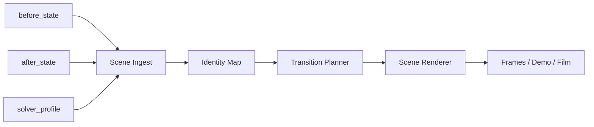

# Architecture

## Kernfrage

Wie wird ein komplexer Exponent,
der zunaechst als kompakte Exponenten-Einheit sichtbar ist,
so in einen normalen Termraum ueberfuehrt,
dass der Uebergang lesbar,
positionell nachvollziehbar
und didaktisch sinnvoll bleibt?

## Harte Systemgrenze

Der bestehende zentrale Gleichungsloeser
bleibt vollstaendig autonom.

Er arbeitet weiterhin **zu 100 Prozent nach seinen eigenen Regeln**.

Das Transition-Projekt
oder ein neuer Uebergangsloeser
darf diese Regeln weder aendern
noch intern mitbenutzen.

Zulaessig ist nur:

- ein exportiertes Profil des alten Loesers
- explizit uebergebene Zustandsdaten
- ein eigener Zielzustand des Folge-Systems

Nicht zulaessig ist:

- interne Heuristiken des alten Loesers im bestehenden System zu veraendern
- vom alten Loeser mehr zu erwarten als sein exportiertes Profil
- Aenderungen am alten Loeser vorzunehmen,
  nur um den Uebergang leichter zu machen

## Trennung in vier Module

### 1. Scene Ingest

Aufgabe:

- `before_state` lesen
- `after_state` lesen
- `solver_profile` lesen, falls vorhanden
- beide in ein gemeinsames Szenenformat uebersetzen

Darf nicht:

- Mathematik neu entscheiden
- Geometrie animieren

### 2. Identity Map

Aufgabe:

- festlegen,
  welche Elemente in `before` und `after`
  semantisch dieselben sind
- stabile Spuren fuer dieselben Inhalte bauen

Darf nicht:

- Kamerawege festlegen
- Zwischenpositionen schoenrechnen

### 3. Transition Planner

Aufgabe:

- aus zwei festen Szenen
  einen Bewegungsplan erzeugen
- Zoom,
  Faltung,
  Aufklappung,
  Entzerrung
  oder andere Zwischenmodi zeitlich anordnen

Darf nicht:

- den Start- oder Endzustand aendern

### 4. Scene Renderer

Aufgabe:

- den Bewegungsplan sichtbar machen
- Frames,
  SVG,
  Canvas,
  Video
  oder Diagnosebilder erzeugen

Darf nicht:

- Algebra,
  IDs
  oder Identitaetsmapping neu erfinden

## Ablauf

## Eigentumsregel

- Das bestehende Projekt besitzt mathematische Zustaende.
- Das bestehende Projekt besitzt auch seine eigenen Solverregeln.
- Dieses Projekt besitzt nur die Uebergangsinszenierung.
- Dieses Projekt besitzt **nicht** die Regellogik des alten Loesers.

Wenn ein neuer Loeser
spaeter nach aehnlichen Prinzipien
wie der alte Loeser arbeiten soll,
dann entsteht er als **eigene Kopie oder eigener Fork**.

Er darf die Prinzipien des alten Loesers
vollstaendig nachbauen.

Er entsteht aber **nicht**
durch Ueberschreiben
oder Umbau des alten zentralen Loesers.

## Folge fuer Papier und Film

Die Landeposition nach dem Systemwechsel
muss deshalb aus dem **Profil des alten Loesers**
und aus dem **Zielprofil des neuen Systems**
abgeleitet werden.

Sie darf nicht aus verstecktem Wissen
ueber Aenderungen am alten System stammen.

## Wichtigste Designentscheidung

Der Uebergang ist **kein weiterer Zeilenschritt**.

Er ist ein eigener Szenenmodus
zwischen zwei Zeilenwelten.

## Schalenkontinuitaet ueber die Grenze

Der Grenzschritt zerstoert keine vorhandenen Schalen,
wenn diese mathematisch nicht geoeffnet werden.

Beispiele dafuer sind:

- ein sichtbarer Bruch auf der durchgereichten Seite
- eine Klammergruppe
- eine Funktionsschale

Fuer den Uebergang gilt daher:

- die durchgereichte Seite bleibt als bestehende Schale erhalten
- `B` darf nur eine neue aeussere Operatorschale darum aufbauen,
  zum Beispiel `log_B(...)`
- die innere Schale wird dabei nicht neu verteilt,
  nicht neu zentriert
  und nicht intern geoeffnet

## Typographiegrenze des Exponenteninhalts

Der Inhalt des komplexen Exponenten wechselt an der Grenze
seinen Darstellungsmodus.

Vor der Grenze ist er:

- Exponenteninhalt
- typographisch an die Potenz gebunden

Nach der Grenze ist er:

- normaler Terminhalt
- in Grundgroesse
- auf normaler horizontaler Ebene

Wichtig ist:

- dieselbe Inhaltsgeschichte bleibt erhalten
- nur ihr Darstellungsmodus aendert sich
- `B` liefert also keinen Exponenten mehr an `A2`,
  sondern bereits normalen Terminhalt

## Keine spekulativen Zukunftsspalten

Wenn eine innere Schale spaeter nie geoeffnet wird,
darf der Uebergang dafuer keine kuenstlichen Zukunftsspalten reservieren.

Das bedeutet:

- innere Atome koennen semantisch bekannt bleiben
- innere Atome brauchen keine eigenen Zukunftsspalten,
  wenn sie nie von ihrer Schale getrennt werden
- trotzdem muss ihr geschlossener Schalenverband
  nicht schon fuer spaetere hypothetische Trennungen aufgefaechert werden

Neue Spalten entstehen erst dann,
wenn ein spaeterer echter Solver-Schritt
einen Inhalt wirklich freilegt oder bewegt.

## Anschluss an A2

`B` endet genau bei der ersten echten Zeile von `A2`.

Diese Startzeile muss so gebaut sein,
dass `A2` danach sofort mit seinen eigenen Regeln weiterarbeiten kann.

Das heisst insbesondere:

- neu bewegte Inhalte wie ein spaeter hinzugefuegtes `c +`
  bekommen erst dann eigene Spalten,
  wenn sie im normalen Termraum wirklich verschoben werden
- eine bereits vorhandene linke oder rechte Schale
  bleibt bis dahin stabil
- wenn `A2` danach einen aeusseren Bruch baut,
  geht die ganze bestehende Seite als Schale in den Zaehler oder Nenner ein,
  statt intern neu angeordnet zu werden
